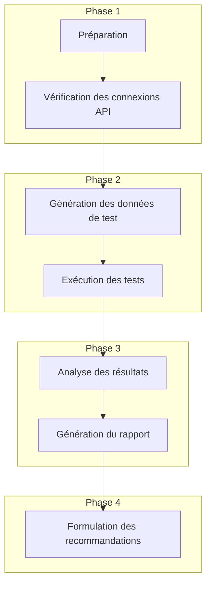

# Plan d'exécution de la campagne de tests et génération du rapport d'analyse

## 1. Préparation de l'environnement

### 1.1 Configuration des clés API
- Vérifier que le fichier `.env` contient les clés API nécessaires :
  - `OPENAI_API_KEY` pour les modèles OpenAI
  - `OPENROUTER_API_KEY` pour les modèles via OpenRouter (valeur fournie : `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`)

### 1.2 Modification des scripts

#### 1.2.1 Correction de la fonction `Invoke-PythonScript`
La fonction `Invoke-PythonScript` dans `run_real_models_campaign.ps1` a déjà été corrigée pour passer correctement les arguments aux scripts Python.

#### 1.2.2 Mise à jour de la liste des modèles à tester
Modifier la liste des modèles dans `run_real_models_campaign.ps1` selon les spécifications :

```powershell
$modelsToTest = @(
    # Modèles OpenAI
    "gpt-4o",
    "gpt-4o-mini",
    "gpt-3.5-turbo",
    
    # Modèles O3 et O4-mini (à tester)
    "o3",
    "o4-mini",
    
    # Modèles via OpenRouter
    "anthropic/claude-3-sonnet-20240229",  # Claude 3.7 Sonnet
    "google/gemini-pro-1.5",               # Gemini 2.5 Pro
    
    # Modèles Qwen via OpenRouter
    "qwen/qwen-1.5b",                      # Qwen 3 1.5B
    "qwen/qwen-8b",                        # Qwen 3 8B
    "qwen/qwen-14b",                       # Qwen 3 14B
    "qwen/qwen-30b-a3b",                   # Qwen 3 30B A3B
    "qwen/qwen-32b"                        # Qwen 3 32B
)
```

## 2. Exécution de la campagne de tests

### 2.1 Vérification des connexions API
- Exécuter le script `verify_api_connections.py` pour s'assurer que les connexions à OpenAI et OpenRouter sont fonctionnelles
- Vérifier que les modèles spécifiés sont disponibles via les API

### 2.2 Génération des données de test
- Exécuter le script `transparent_model_test.py` avec l'option `--generate-data` pour créer des jeux de données de test
- Les données seront générées pour différents niveaux de complexité (Trivial, Simple, Medium, Hard)

### 2.3 Exécution des tests avec les modèles réels
- Pour chaque modèle dans la liste `$modelsToTest` :
  - Déterminer le provider approprié (OpenAI ou OpenRouter)
  - Exécuter le script `transparent_model_test.py` avec les paramètres appropriés
  - Collecter les résultats dans le répertoire de logs

### 2.4 Analyse des résultats
- Exécuter le script `analyze_real_models.py` pour analyser les résultats des tests
- Générer des visualisations et des statistiques comparatives

### 2.5 Génération du rapport final
- Combiner les résultats d'analyse en un rapport final complet
- Inclure des recommandations basées sur les performances des modèles

## 3. Analyse et optimisation

### 3.1 Comparaison des performances des modèles
- Analyser les taux de réussite par modèle
- Comparer les temps d'exécution et les coûts
- Évaluer l'efficacité coût/performance

### 3.2 Analyse par niveau de complexité
- Évaluer les performances des modèles selon les niveaux de complexité des prompts
- Identifier les modèles les plus adaptés à chaque niveau de complexité

### 3.3 Recommandations pour l'optimisation du MultiConnector
- Proposer des stratégies de routage basées sur les performances des modèles
- Suggérer des optimisations pour les transformations de prompts
- Recommander des configurations pour différents cas d'utilisation

## 4. Livrables

### 4.1 Résultats bruts
- Logs d'exécution des tests pour chaque modèle
- Données de performance collectées

### 4.2 Rapport d'analyse
- Rapport détaillé au format Markdown
- Visualisations des performances comparatives
- Tableaux de statistiques

### 4.3 Recommandations
- Document de recommandations pour l'optimisation du MultiConnector
- Stratégies de routage proposées
- Suggestions pour les futures campagnes de tests

## 5. Diagramme du flux de travail



## 6. Problèmes potentiels et solutions

### 6.1 Problèmes d'encodage
- Problème : Caractères spéciaux mal encodés dans les rapports (ex: "Modèles" au lieu de "Modèles")
- Solution : Utiliser l'encodage UTF-8 explicitement dans tous les fichiers de sortie

### 6.2 Modèles non disponibles
- Problème : Certains modèles spécifiés peuvent ne pas être disponibles via OpenRouter
- Solution : Implémenter une logique de fallback pour utiliser des modèles alternatifs

### 6.3 Erreurs d'API
- Problème : Limites de taux, timeouts ou autres erreurs d'API
- Solution : Implémenter des mécanismes de retry avec backoff exponentiel

### 6.4 Problèmes de passage d'arguments
- Problème : Arguments mal passés aux scripts Python
- Solution : La fonction `Invoke-PythonScript` a été corrigée pour passer correctement les arguments