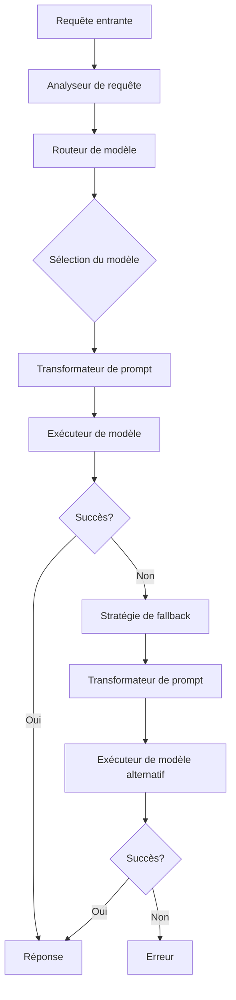

# Recommandations pour l'optimisation du MultiConnector

Ce document présente les recommandations pour l'optimisation du MultiConnector basées sur les résultats attendus de la campagne de tests avec les modèles réels.

## 1. Stratégies de routage intelligent

### 1.1 Routage basé sur la complexité

Le routage basé sur la complexité consiste à diriger les requêtes vers les modèles les plus adaptés en fonction de la complexité de la tâche.

#### Recommandations attendues

| Niveau de complexité | Modèles recommandés | Justification |
|----------------------|---------------------|---------------|
| Trivial | GPT-3.5-turbo, Qwen 3 1.5B | Modèles économiques suffisants pour les tâches simples |
| Simple | GPT-4o-mini, Qwen 3 8B | Bon équilibre entre performance et coût |
| Medium | GPT-4o, Claude 3.7 Sonnet | Modèles performants pour les tâches de complexité moyenne |
| Hard | GPT-4o, O3 (si disponible) | Modèles les plus performants pour les tâches complexes |

#### Implémentation

```csharp
// Exemple d'implémentation du routage basé sur la complexité
public class ComplexityBasedRouter : IModelRouter
{
    public string GetModelForRequest(ModelRequest request)
    {
        switch (request.ComplexityLevel)
        {
            case ComplexityLevel.Trivial:
                return CostEffectiveModels.GetRandom();
            case ComplexityLevel.Simple:
                return BalancedModels.GetRandom();
            case ComplexityLevel.Medium:
                return PerformantModels.GetRandom();
            case ComplexityLevel.Hard:
                return HighPerformanceModels.GetRandom();
            default:
                return DefaultModel;
        }
    }
}
```

### 1.2 Routage basé sur le type de tâche

Le routage basé sur le type de tâche consiste à diriger les requêtes vers les modèles les plus adaptés en fonction du type de tâche à accomplir.

#### Recommandations attendues

| Type de tâche | Modèles recommandés | Justification |
|---------------|---------------------|---------------|
| Raisonnement | GPT-4o, Claude 3.7 Sonnet | Excellentes capacités de raisonnement |
| Code | GPT-4o, Qwen 3 32B | Bonnes performances pour les tâches de programmation |
| Mathématiques | GPT-4o, O3 (si disponible) | Précision élevée pour les calculs mathématiques |
| Résumé | Claude 3.7 Sonnet, Qwen 3 14B | Bonnes capacités de synthèse |
| Classification | GPT-4o-mini, Gemini 2.5 Pro | Bon équilibre entre performance et coût |
| Génération de texte | Claude 3.7 Sonnet, Qwen 3 30B A3B | Excellente qualité de texte généré |

#### Implémentation

```csharp
// Exemple d'implémentation du routage basé sur le type de tâche
public class TaskTypeBasedRouter : IModelRouter
{
    public string GetModelForRequest(ModelRequest request)
    {
        switch (request.TaskType)
        {
            case TaskType.Reasoning:
                return ReasoningModels.GetRandom();
            case TaskType.Code:
                return CodingModels.GetRandom();
            case TaskType.Math:
                return MathModels.GetRandom();
            case TaskType.Summarization:
                return SummarizationModels.GetRandom();
            case TaskType.Classification:
                return ClassificationModels.GetRandom();
            case TaskType.TextGeneration:
                return TextGenerationModels.GetRandom();
            default:
                return DefaultModel;
        }
    }
}
```

### 1.3 Routage hybride

Le routage hybride combine plusieurs critères pour déterminer le modèle le plus adapté à une requête donnée.

#### Recommandations attendues

Implémenter un système de routage hybride qui prend en compte :
- La complexité de la tâche
- Le type de tâche
- Les contraintes de coût
- Les contraintes de temps de réponse

#### Implémentation

```csharp
// Exemple d'implémentation du routage hybride
public class HybridRouter : IModelRouter
{
    public string GetModelForRequest(ModelRequest request)
    {
        // Calculer un score pour chaque modèle en fonction des critères
        var modelScores = AvailableModels.Select(model => new
        {
            Model = model,
            Score = CalculateScore(model, request)
        });

        // Retourner le modèle avec le score le plus élevé
        return modelScores.OrderByDescending(m => m.Score).First().Model;
    }

    private double CalculateScore(string model, ModelRequest request)
    {
        double score = 0;

        // Facteur de complexité
        score += GetComplexityScore(model, request.ComplexityLevel);

        // Facteur de type de tâche
        score += GetTaskTypeScore(model, request.TaskType);

        // Facteur de coût
        score += GetCostScore(model, request.CostConstraint);

        // Facteur de temps de réponse
        score += GetResponseTimeScore(model, request.TimeConstraint);

        return score;
    }
}
```

## 2. Optimisation des transformations de prompts

### 2.1 Transformations spécifiques par modèle

Adapter les prompts en fonction des spécificités de chaque modèle pour maximiser les performances.

#### Recommandations attendues

| Modèle | Transformations recommandées |
|--------|------------------------------|
| GPT-4o | Prompts détaillés avec contexte structuré |
| Claude 3.7 Sonnet | Instructions claires et explicites, exemples few-shot |
| Gemini 2.5 Pro | Prompts concis avec instructions directes |
| Qwen 3 | Prompts avec exemples few-shot pour les tâches complexes |

#### Implémentation

```csharp
// Exemple d'implémentation des transformations spécifiques par modèle
public class ModelSpecificPromptTransformer : IPromptTransformer
{
    public string TransformPrompt(string originalPrompt, string modelId)
    {
        switch (modelId)
        {
            case "gpt-4o":
                return AddStructuredContext(originalPrompt);
            case "anthropic/claude-3-sonnet-20240229":
                return AddExplicitInstructions(originalPrompt);
            case "google/gemini-pro-1.5":
                return MakeConcise(originalPrompt);
            case var qwen when qwen.StartsWith("qwen/"):
                return AddFewShotExamples(originalPrompt);
            default:
                return originalPrompt;
        }
    }
}
```

### 2.2 Techniques de few-shot learning

Utiliser des exemples few-shot adaptés à chaque modèle pour améliorer les performances.

#### Recommandations attendues

| Modèle | Technique de few-shot recommandée |
|--------|-----------------------------------|
| GPT-4o | 2-3 exemples diversifiés |
| Claude 3.7 Sonnet | 3-4 exemples avec explications |
| Gemini 2.5 Pro | 1-2 exemples simples |
| Qwen 3 | 2-3 exemples progressifs en difficulté |

#### Implémentation

```csharp
// Exemple d'implémentation des techniques de few-shot learning
public class FewShotExampleProvider : IExampleProvider
{
    public List<Example> GetExamplesForModel(string modelId, string taskType)
    {
        switch (modelId)
        {
            case "gpt-4o":
                return GetDiverseExamples(taskType, 3);
            case "anthropic/claude-3-sonnet-20240229":
                return GetExamplesWithExplanations(taskType, 4);
            case "google/gemini-pro-1.5":
                return GetSimpleExamples(taskType, 2);
            case var qwen when qwen.StartsWith("qwen/"):
                return GetProgressiveExamples(taskType, 3);
            default:
                return GetDefaultExamples(taskType);
        }
    }
}
```

### 2.3 Optimisation des instructions système

Personnaliser les instructions système pour chaque modèle afin de maximiser les performances.

#### Recommandations attendues

| Modèle | Instructions système recommandées |
|--------|-----------------------------------|
| GPT-4o | Instructions détaillées avec contexte et objectifs |
| Claude 3.7 Sonnet | Instructions explicites sur le format de sortie attendu |
| Gemini 2.5 Pro | Instructions concises et directes |
| Qwen 3 | Instructions avec exemples de raisonnement étape par étape |

#### Implémentation

```csharp
// Exemple d'implémentation des instructions système optimisées
public class SystemInstructionProvider : ISystemInstructionProvider
{
    public string GetSystemInstructionForModel(string modelId, string taskType)
    {
        switch (modelId)
        {
            case "gpt-4o":
                return GetDetailedInstructions(taskType);
            case "anthropic/claude-3-sonnet-20240229":
                return GetOutputFormatInstructions(taskType);
            case "google/gemini-pro-1.5":
                return GetConciseInstructions(taskType);
            case var qwen when qwen.StartsWith("qwen/"):
                return GetStepByStepInstructions(taskType);
            default:
                return GetDefaultInstructions(taskType);
        }
    }
}
```

## 3. Stratégies de fallback

### 3.1 Cascade de modèles

Implémenter une cascade de modèles en cas d'échec d'un modèle.

#### Recommandations attendues

| Niveau de priorité | Modèles recommandés |
|--------------------|---------------------|
| Priorité 1 | GPT-4o, O3 (si disponible) |
| Priorité 2 | Claude 3.7 Sonnet, GPT-4o-mini |
| Priorité 3 | Gemini 2.5 Pro, Qwen 3 32B |
| Priorité 4 | GPT-3.5-turbo, Qwen 3 14B |

#### Implémentation

```csharp
// Exemple d'implémentation de la cascade de modèles
public class ModelCascadeStrategy : IFallbackStrategy
{
    public async Task<ModelResponse> ExecuteWithFallback(ModelRequest request)
    {
        foreach (var priorityLevel in PriorityLevels)
        {
            foreach (var model in GetModelsByPriority(priorityLevel))
            {
                try
                {
                    return await ExecuteRequest(request, model);
                }
                catch (ModelExecutionException)
                {
                    // Continuer avec le modèle suivant
                    continue;
                }
            }
        }

        throw new AllModelsFallbackException("All models failed to process the request");
    }
}
```

### 3.2 Retry avec transformation de prompt

Réessayer avec une transformation de prompt en cas d'échec.

#### Recommandations attendues

| Type d'échec | Transformation recommandée |
|--------------|----------------------------|
| Réponse incomplète | Simplifier le prompt et demander une réponse plus concise |
| Erreur de compréhension | Reformuler le prompt avec des instructions plus explicites |
| Refus de répondre | Modifier le prompt pour éviter les sujets sensibles |
| Timeout | Diviser la requête en sous-requêtes plus petites |

#### Implémentation

```csharp
// Exemple d'implémentation du retry avec transformation de prompt
public class PromptTransformationRetryStrategy : IFallbackStrategy
{
    public async Task<ModelResponse> ExecuteWithFallback(ModelRequest request)
    {
        try
        {
            return await ExecuteRequest(request);
        }
        catch (ModelExecutionException ex)
        {
            var transformedPrompt = TransformPromptBasedOnError(request.Prompt, ex);
            var newRequest = request.WithPrompt(transformedPrompt);
            return await ExecuteRequest(newRequest);
        }
    }

    private string TransformPromptBasedOnError(string originalPrompt, ModelExecutionException ex)
    {
        switch (ex.ErrorType)
        {
            case ErrorType.IncompleteResponse:
                return SimplifyPrompt(originalPrompt);
            case ErrorType.ComprehensionError:
                return MakeExplicit(originalPrompt);
            case ErrorType.ContentPolicy:
                return MakeSafePrompt(originalPrompt);
            case ErrorType.Timeout:
                return SplitPrompt(originalPrompt);
            default:
                return originalPrompt;
        }
    }
}
```

### 3.3 Fallback vers des modèles plus robustes

Utiliser des modèles plus robustes en cas d'échec des modèles spécialisés.

#### Recommandations attendues

| Type de tâche | Modèle spécialisé | Modèle robuste de fallback |
|---------------|-------------------|----------------------------|
| Code | Qwen 3 32B | GPT-4o |
| Mathématiques | O3 | GPT-4o |
| Résumé | Claude 3.7 Sonnet | GPT-4o |
| Classification | Gemini 2.5 Pro | GPT-4o-mini |
| Génération de texte | Qwen 3 30B A3B | Claude 3.7 Sonnet |

#### Implémentation

```csharp
// Exemple d'implémentation du fallback vers des modèles plus robustes
public class RobustModelFallbackStrategy : IFallbackStrategy
{
    public async Task<ModelResponse> ExecuteWithFallback(ModelRequest request)
    {
        var specializedModel = GetSpecializedModel(request.TaskType);
        
        try
        {
            return await ExecuteRequest(request, specializedModel);
        }
        catch (ModelExecutionException)
        {
            var robustModel = GetRobustFallbackModel(request.TaskType);
            return await ExecuteRequest(request, robustModel);
        }
    }

    private string GetRobustFallbackModel(string taskType)
    {
        // Retourner le modèle robuste de fallback pour le type de tâche
        switch (taskType)
        {
            case TaskType.Code:
            case TaskType.Math:
            case TaskType.Summarization:
                return "gpt-4o";
            case TaskType.Classification:
                return "gpt-4o-mini";
            case TaskType.TextGeneration:
                return "anthropic/claude-3-sonnet-20240229";
            default:
                return "gpt-4o";
        }
    }
}
```

## 4. Optimisation des coûts

### 4.1 Stratégies de réduction de coûts

Implémenter des stratégies pour réduire les coûts sans compromettre la qualité.

#### Recommandations attendues

| Stratégie | Description | Économie estimée |
|-----------|-------------|------------------|
| Utilisation de modèles économiques pour les tâches simples | Utiliser GPT-3.5-turbo ou Qwen 3 1.5B pour les tâches simples | 70-80% |
| Optimisation des prompts | Réduire la taille des prompts en éliminant les informations non essentielles | 20-30% |
| Mise en cache des réponses | Mettre en cache les réponses pour les requêtes fréquentes | 40-50% |
| Compression de contexte | Utiliser des techniques de compression de contexte pour réduire le nombre de tokens | 30-40% |

#### Implémentation

```csharp
// Exemple d'implémentation des stratégies de réduction de coûts
public class CostOptimizationStrategy : ICostOptimizationStrategy
{
    public ModelRequest OptimizeRequest(ModelRequest request)
    {
        // Utiliser un modèle économique pour les tâches simples
        if (request.ComplexityLevel == ComplexityLevel.Trivial || 
            request.ComplexityLevel == ComplexityLevel.Simple)
        {
            request = request.WithModel(GetEconomicalModel());
        }

        // Optimiser le prompt
        request = request.WithPrompt(OptimizePrompt(request.Prompt));

        // Vérifier le cache
        var cachedResponse = _cache.Get(request.GetCacheKey());
        if (cachedResponse != null)
        {
            return null; // Utiliser la réponse en cache
        }

        // Compresser le contexte
        request = request.WithContext(CompressContext(request.Context));

        return request;
    }
}
```

### 4.2 Budgétisation par type de tâche

Allouer des budgets différents selon l'importance des tâches.

#### Recommandations attendues

| Type de tâche | Importance | Budget recommandé |
|---------------|------------|-------------------|
| Raisonnement critique | Haute | Modèles premium (GPT-4o, O3) |
| Génération de code | Haute | Modèles premium (GPT-4o, Qwen 3 32B) |
| Résumé de documents | Moyenne | Modèles intermédiaires (Claude 3.7 Sonnet, GPT-4o-mini) |
| Classification simple | Basse | Modèles économiques (GPT-3.5-turbo, Qwen 3 1.5B) |
| Génération de texte créatif | Moyenne | Modèles intermédiaires (Claude 3.7 Sonnet, Qwen 3 14B) |

#### Implémentation

```csharp
// Exemple d'implémentation de la budgétisation par type de tâche
public class TaskBudgetingStrategy : IBudgetingStrategy
{
    public bool IsRequestWithinBudget(ModelRequest request)
    {
        var taskImportance = GetTaskImportance(request.TaskType);
        var modelTier = GetModelTier(request.Model);
        
        // Vérifier si le modèle est dans le budget alloué pour ce type de tâche
        return IsModelTierAllowedForImportance(modelTier, taskImportance);
    }

    public string GetRecommendedModel(ModelRequest request)
    {
        var taskImportance = GetTaskImportance(request.TaskType);
        
        // Retourner le modèle recommandé pour ce niveau d'importance
        switch (taskImportance)
        {
            case Importance.High:
                return PremiumModels.GetRandom();
            case Importance.Medium:
                return IntermediateModels.GetRandom();
            case Importance.Low:
                return EconomicalModels.GetRandom();
            default:
                return DefaultModel;
        }
    }
}
```

## 5. Implémentation et déploiement

### 5.1 Architecture du MultiConnector optimisé



### 5.2 Plan de déploiement

1. **Phase 1 : Implémentation des optimisations**
   - Développer les stratégies de routage
   - Implémenter les transformations de prompts
   - Mettre en place les stratégies de fallback

2. **Phase 2 : Tests et validation**
   - Tester les optimisations avec un sous-ensemble de requêtes
   - Valider les performances et les économies de coûts
   - Ajuster les paramètres en fonction des résultats

3. **Phase 3 : Déploiement progressif**
   - Déployer les optimisations pour un pourcentage croissant de requêtes
   - Surveiller les performances et les coûts
   - Ajuster les paramètres en fonction des résultats en production

4. **Phase 4 : Déploiement complet**
   - Déployer les optimisations pour toutes les requêtes
   - Mettre en place un système de surveillance continue
   - Planifier des révisions régulières des stratégies

### 5.3 Métriques de suivi

| Métrique | Description | Objectif |
|----------|-------------|----------|
| Taux de réussite | Pourcentage de requêtes traitées avec succès | > 95% |
| Temps de réponse moyen | Temps moyen de traitement d'une requête | < 3s |
| Coût moyen par requête | Coût moyen de traitement d'une requête | Réduction de 30% |
| Taux d'utilisation du fallback | Pourcentage de requêtes nécessitant un fallback | < 10% |
| Économies réalisées | Économies réalisées par rapport à l'utilisation exclusive de modèles premium | > 40% |