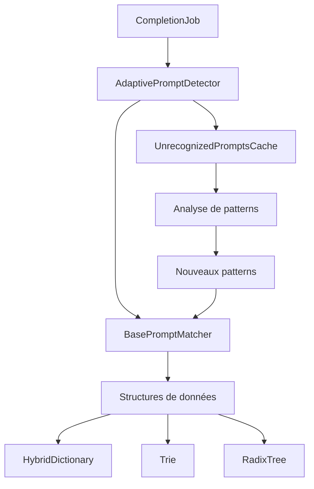
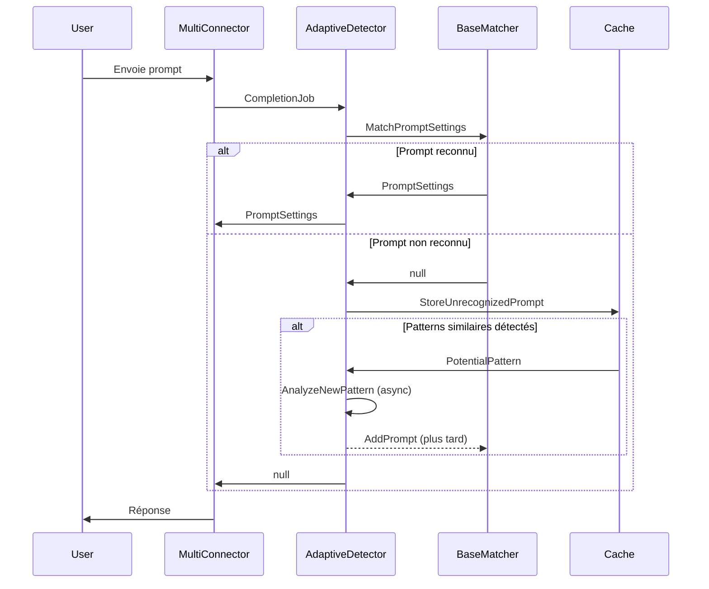
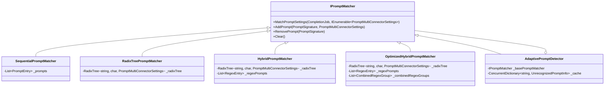
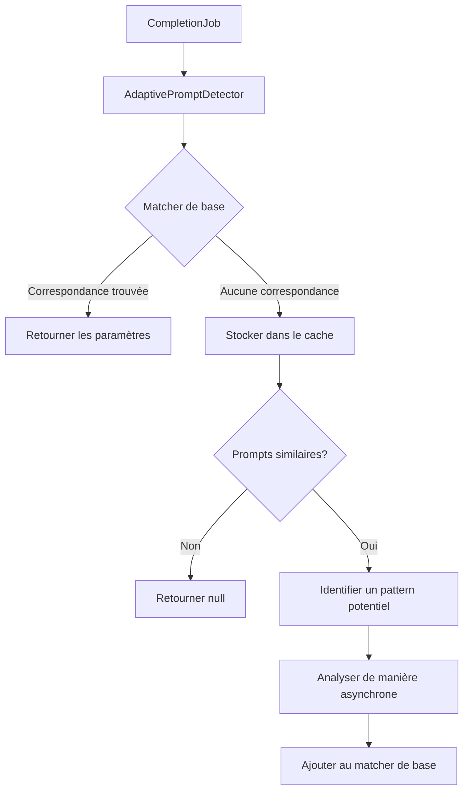
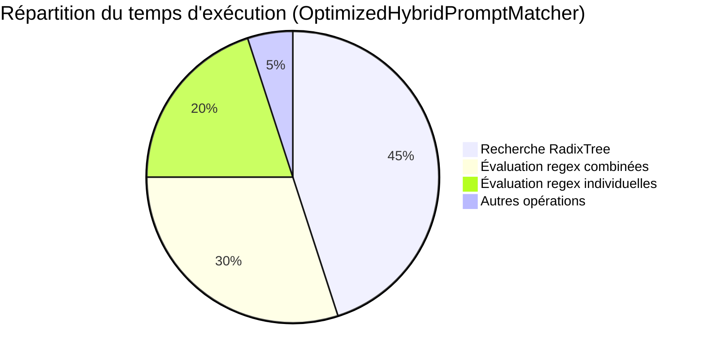

# Système Amélioré de Détection de Signatures des Prompts

## Table des matières

1. [Vue d'ensemble du système](#1-vue-densemble-du-système)
   1. [Description du problème résolu](#11-description-du-problème-résolu)
   2. [Architecture globale du système](#12-architecture-globale-du-système)
   3. [Diagrammes des composants principaux](#13-diagrammes-des-composants-principaux)
2. [Structures de données fondamentales](#2-structures-de-données-fondamentales)
   1. [HybridDictionary](#21-hybriddictionary)
   2. [Trie](#22-trie)
   3. [RadixTree](#23-radixtree)
   4. [Comparaison des performances](#24-comparaison-des-performances)
3. [Matchers de prompts](#3-matchers-de-prompts)
   1. [SequentialPromptMatcher (référence)](#31-sequentialpromptmatcher-référence)
   2. [RadixTreePromptMatcher](#32-radixtreepromptmatcher)
   3. [HybridPromptMatcher](#33-hybridpromptmatcher)
   4. [OptimizedHybridPromptMatcher](#34-optimizedhybridpromptmatcher)
   5. [Comparaison des performances](#35-comparaison-des-performances)
4. [Détection adaptative](#4-détection-adaptative)
   1. [Fonctionnement du AdaptivePromptDetector](#41-fonctionnement-du-adaptivepromptdetector)
   2. [Configuration et paramétrage](#42-configuration-et-paramétrage)
   3. [Cas d'utilisation recommandés](#43-cas-dutilisation-recommandés)
5. [Guide d'intégration](#5-guide-dintégration)
   1. [Comment intégrer ces améliorations dans un projet existant](#51-comment-intégrer-ces-améliorations-dans-un-projet-existant)
   2. [Exemples de code en C#](#52-exemples-de-code-en-c)
   3. [Exemples de code en Python](#53-exemples-de-code-en-python)
   4. [Bonnes pratiques](#54-bonnes-pratiques)
6. [Résultats des tests de performance](#6-résultats-des-tests-de-performance)
   1. [Méthodologie](#61-méthodologie)
   2. [Résultats comparatifs](#62-résultats-comparatifs)
   3. [Recommandations selon les cas d'usage](#63-recommandations-selon-les-cas-dusage)
7. [Maintenance et évolution](#7-maintenance-et-évolution)
   1. [Comment étendre le système](#71-comment-étendre-le-système)
   2. [Pistes d'amélioration futures](#72-pistes-damélioration-futures)
8. [Annexes](#8-annexes)
   1. [Glossaire](#81-glossaire)
   2. [Références](#82-références)

## 1. Vue d'ensemble du système

### 1.1 Description du problème résolu

Le système amélioré de détection de signatures des prompts répond à plusieurs défis critiques dans le traitement des requêtes textuelles adressées aux modèles d'IA :

- **Identification efficace des patterns** : Le système permet de reconnaître rapidement des motifs spécifiques dans les prompts utilisateurs, même lorsque ces prompts contiennent des variations.
- **Paramétrage contextuel** : Une fois un prompt identifié, le système associe automatiquement des paramètres optimaux (température, nombre de tokens, etc.) pour obtenir la meilleure réponse possible.
- **Gestion des prompts inconnus** : Le système peut détecter et s'adapter à de nouveaux types de prompts qui n'ont pas été explicitement définis.
- **Performance à l'échelle** : L'architecture est conçue pour gérer efficacement un grand nombre de patterns de prompts sans dégradation significative des performances.
- **Flexibilité des patterns** : Support pour différents types de patterns, des préfixes simples aux expressions régulières complexes.

Ces améliorations permettent d'optimiser l'interaction avec les modèles d'IA en adaptant dynamiquement les paramètres de requête en fonction du contexte, ce qui améliore la qualité des réponses tout en réduisant les coûts d'utilisation.
### 1.2 Architecture globale du système

Le système de détection de signatures des prompts s'intègre dans l'architecture plus large du MultiConnector, qui sert d'interface unifiée pour interagir avec différents modèles d'IA. Voici les principaux composants de l'architecture :

1. **CompletionJob** : Représente une requête de complétion de texte, contenant le prompt de l'utilisateur et les paramètres de requête par défaut.

2. **IPromptMatcher** : Interface définissant les opérations de base pour la détection de patterns dans les prompts.
   - Implémentations : SequentialPromptMatcher, RadixTreePromptMatcher, HybridPromptMatcher, OptimizedHybridPromptMatcher

3. **AdaptivePromptDetector** : Décorateur qui étend n'importe quelle implémentation de IPromptMatcher avec des capacités d'apprentissage et d'adaptation.

4. **Structures de données spécialisées** : HybridDictionary, Trie et RadixTree, optimisées pour différents aspects de la recherche de patterns.

5. **PromptSignature** : Définit un pattern de prompt, pouvant être un préfixe simple ou une expression régulière.

6. **PromptMultiConnectorSettings** : Contient les paramètres à utiliser lorsqu'un prompt correspond à une signature spécifique.

Le flux de traitement typique est le suivant :

1. Un CompletionJob est créé à partir du prompt de l'utilisateur.
2. Le CompletionJob est transmis à l'AdaptivePromptDetector.
3. L'AdaptivePromptDetector tente d'abord de faire correspondre le prompt à un pattern connu via le matcher de base.
4. Si une correspondance est trouvée, les paramètres associés sont retournés.
5. Si aucune correspondance n'est trouvée, le prompt est stocké dans le cache des prompts non reconnus.
6. Si suffisamment de prompts similaires sont détectés, un nouveau pattern est identifié et ajouté au matcher de base.

Cette architecture en couches permet une grande flexibilité et extensibilité, tout en maintenant des performances élevées.

### 1.3 Diagrammes des composants principaux

#### Architecture générale



#### Flux de traitement d'un prompt



#### Hiérarchie des matchers



## 2. Structures de données fondamentales

### 2.1 HybridDictionary

Le `HybridDictionary` est une structure de données qui combine les avantages d'une liste et d'un dictionnaire standard, avec un mécanisme d'adaptation dynamique basé sur le nombre d'éléments stockés.

#### Principe de fonctionnement

1. **Mode liste** : Pour un petit nombre d'éléments (inférieur au seuil configuré), le HybridDictionary utilise une simple liste de tuples (clé, valeur).
2. **Mode dictionnaire** : Une fois que le nombre d'éléments dépasse le seuil, il bascule automatiquement vers un dictionnaire standard.
3. **Transition transparente** : La conversion entre les deux modes est gérée en interne et est transparente pour l'utilisateur.

```csharp
// Exemple simplifié de l'implémentation interne
private List<Tuple<K, V>> _itemsList = new List<Tuple<K, V>>();
private Dictionary<K, V> _itemsDict = new Dictionary<K, V>();
private bool _usingDict = false;
private readonly int _threshold;

// Lors de l'ajout d'un élément
public void Add(K key, V value)
#### Avantages

- **Économie de mémoire** : Pour un petit nombre d'éléments, une liste est plus économe en mémoire qu'un dictionnaire.
- **Performance adaptative** : Bascule automatiquement vers la structure la plus efficace en fonction du nombre d'éléments.
- **API unifiée** : Offre une interface cohérente indépendamment de la structure interne utilisée.

#### Cas d'utilisation optimaux

- **Collections de taille variable** : Idéal pour les collections dont la taille peut varier considérablement.
- **Optimisation mémoire** : Particulièrement utile dans les environnements où la mémoire est une ressource critique.
- **Collections initialement petites** : Optimal pour les collections qui commencent petites mais peuvent grandir avec le temps.

### 2.2 Trie

Le `Trie` (arbre préfixe) est une structure de données arborescente optimisée pour la recherche de chaînes par préfixe.

#### Principe de fonctionnement

1. **Structure arborescente** : Chaque nœud représente un caractère d'une chaîne.
2. **Chemins partagés** : Les chaînes avec des préfixes communs partagent le même chemin initial dans l'arbre.
3. **Valeurs aux nœuds terminaux** : Les valeurs sont stockées aux nœuds qui représentent la fin d'une clé complète.

```
Exemple de Trie pour les mots "a", "to", "tea", "ted", "ten", "i", "in", "inn":

        root
       /    \
      t      i
     /        \
    e         n
   /|\         \
  a d n         n
```

#### Implémentation

```csharp
public class Trie<K, E, V>
{
    private class Node
    {
        public Dictionary<E, Node> Children { get; } = new Dictionary<E, Node>();
        public V Value { get; set; }
        public bool HasValue { get; set; }
    }
    
    private readonly Node _root = new Node();
    private readonly Func<K, IEnumerable<E>> _keyToElements;
    
    // Ajouter une clé et sa valeur
    public void Add(K key, V value)
    {
        var elements = _keyToElements(key);
        var node = _root;
        
        foreach (var element in elements)
        {
            if (!node.Children.TryGetValue(element, out var child))
            {
                child = new Node();
                node.Children[element] = child;
            }
            node = child;
        }
        
        node.Value = value;
        node.HasValue = true;
    }
    
    // Rechercher par préfixe
    public (bool found, V value) TryGetValueByPrefix(K prefix)
    {
        var elements = _keyToElements(prefix);
        var node = _root;
        Node lastValueNode = node.HasValue ? node : null;
        
        foreach (var element in elements)
        {
            if (!node.Children.TryGetValue(element, out node))
                break;
                
            if (node.HasValue)
                lastValueNode = node;
        }
        
        return lastValueNode != null ? (true, lastValueNode.Value) : (false, default);
    }
}
```

#### Avantages

- **Recherche par préfixe efficace** : Opération O(m) où m est la longueur du préfixe.
- **Partage de préfixes** : Économie d'espace pour les clés avec des préfixes communs.
- **Énumération lexicographique** : Facilite l'énumération des clés dans l'ordre lexicographique.

#### Limitations

- **Consommation mémoire** : Peut être gourmand en mémoire pour un grand nombre de clés sans préfixes communs.
- **Complexité de mise en œuvre** : Plus complexe à implémenter qu'un dictionnaire standard.

### 2.3 RadixTree

Le `RadixTree` (ou arbre à compression de préfixes) est une optimisation du Trie qui compresse les chemins pour réduire l'espace mémoire utilisé.

#### Principe de fonctionnement

1. **Compression des chemins** : Les nœuds qui n'ont qu'un seul enfant sont fusionnés avec cet enfant.
2. **Stockage de segments** : Chaque arête stocke un segment de chaîne plutôt qu'un seul caractère.
3. **Recherche optimisée** : La recherche est plus rapide car moins de nœuds sont traversés.

```
Exemple de RadixTree pour les mêmes mots que précédemment:

        root
       /    \
      t      i
     /        \
    e         nn
   /|\
  a d n
```
{
    if (_usingDict)
    {
        _itemsDict[key] = value;
#### Implémentation

```csharp
public class RadixTree<K, E, V>
{
    private class Node
    {
        public Dictionary<E, (List<E> Path, Node Child)> Children { get; } = new Dictionary<E, (List<E>, Node)>();
        public V Value { get; set; }
        public bool HasValue { get; set; }
    }
    
    private readonly Node _root = new Node();
    private readonly Func<K, IEnumerable<E>> _keyToElements;
    
    // Ajouter une clé et sa valeur
    public void Add(K key, V value)
    {
        var elements = _keyToElements(key).ToList();
        AddInternal(_root, elements, 0, value);
    }
    
    private void AddInternal(Node node, List<E> elements, int index, V value)
    {
        if (index == elements.Count)
        {
            node.Value = value;
            node.HasValue = true;
            return;
        }
        
        var currentElement = elements[index];
        
        // Chercher une arête existante
        foreach (var kvp in node.Children)
        {
            if (EqualityComparer<E>.Default.Equals(kvp.Key, currentElement))
            {
                var (path, child) = kvp.Value;
                
                // Trouver le préfixe commun
                int commonLength = 0;
                int maxLength = Math.Min(path.Count, elements.Count - index);
                
                while (commonLength < maxLength && 
                       EqualityComparer<E>.Default.Equals(path[commonLength], elements[index + commonLength]))
                {
                    commonLength++;
                }
                
                // Si le préfixe commun est plus court que le chemin existant, diviser le nœud
                if (commonLength < path.Count)
                {
                    var newNode = new Node();
                    node.Children[currentElement] = (path.Take(commonLength).ToList(), newNode);
                    newNode.Children[path[commonLength]] = (path.Skip(commonLength + 1).ToList(), child);
                    
                    if (commonLength < elements.Count - index)
                    {
                        AddInternal(newNode, elements, index + commonLength, value);
                    }
                    else
                    {
                        newNode.Value = value;
                        newNode.HasValue = true;
                    }
                }
                else
                {
                    // Le préfixe commun est égal au chemin existant
                    AddInternal(child, elements, index + commonLength, value);
                }
                
                return;
            }
        }
        
        // Aucune arête existante, créer une nouvelle
        var newChild = new Node { Value = value, HasValue = true };
        node.Children[currentElement] = (elements.Skip(index + 1).ToList(), newChild);
    }
    
    // Recherche par préfixe similaire au Trie mais avec gestion des chemins compressés
    public (bool found, V value) TryGetValueByPrefix(K prefix)
    {
        // Implémentation similaire à Add mais pour la recherche
        // ...
    }
}
```

#### Avantages par rapport au Trie

- **Économie d'espace** : Réduit considérablement l'espace mémoire utilisé en compressant les chemins.
- **Recherche plus rapide** : Moins de nœuds à traverser pour atteindre une clé.
- **Meilleure localité de cache** : Les segments de chaîne sont stockés de manière contiguë, améliorant les performances du cache CPU.

#### Limitations

- **Complexité accrue** : Implémentation et maintenance plus complexes que le Trie standard.
- **Opérations de mise à jour plus coûteuses** : Les insertions et suppressions peuvent nécessiter des réorganisations de l'arbre.

### 2.4 Comparaison des performances

Les trois structures de données présentent des caractéristiques de performance différentes selon les critères d'évaluation :

#### Utilisation mémoire

| Structure | Petit dataset | Dataset moyen | Grand dataset |
|-----------|---------------|---------------|---------------|
| HybridDictionary | Excellente | Bonne | Moyenne |
| Trie | Moyenne | Moyenne | Faible |
| RadixTree | Bonne | Excellente | Bonne |

#### Vitesse de recherche

| Structure | Recherche exacte | Recherche par préfixe | Recherche par regex |
|-----------|------------------|------------------------|---------------------|
| HybridDictionary | Excellente (grand dataset) | Non supportée | Non supportée |
| Trie | Bonne | Excellente | Non supportée |
| RadixTree | Très bonne | Excellente | Non supportée |

#### Complexité des opérations

| Structure | Insertion | Suppression | Recherche |
|-----------|-----------|-------------|-----------|
| HybridDictionary | O(1) ou O(n) | O(1) ou O(n) | O(1) ou O(n) |
| Trie | O(m) | O(m) | O(m) |
| RadixTree | O(m) | O(m) | O(m) |

Où :
- n est le nombre d'éléments
- m est la longueur de la clé

#### Recommandations d'utilisation

- **HybridDictionary** : Idéal pour les collections de taille variable avec des recherches exactes.
- **Trie** : Optimal pour les recherches par préfixe avec un nombre modéré de clés.
- **RadixTree** : Recommandé pour les recherches par préfixe avec un grand nombre de clés ayant des préfixes communs.

## 3. Matchers de prompts

### 3.1 SequentialPromptMatcher (référence)

Le `SequentialPromptMatcher` est l'implémentation la plus simple du système de détection de signatures de prompts. Il sert de référence pour comparer les performances des autres implémentations.

#### Principe de fonctionnement

1. **Stockage linéaire** : Les signatures de prompts sont stockées dans une liste simple.
2. **Recherche séquentielle** : Pour trouver une correspondance, chaque signature est testée séquentiellement.
3. **Correspondance exacte ou par regex** : Supporte à la fois les correspondances exactes et les expressions régulières.
    }
    else
    {
        _itemsList.Add(Tuple.Create(key, value));
        
        // Basculer vers un dictionnaire si le seuil est dépassé
        if (_itemsList.Count > _threshold)
        {
            _itemsDict = _itemsList.ToDictionary(item => item.Item1, item => item.Item2);
            _itemsList.Clear();
            _usingDict = true;
        }
    }
#### Implémentation

```csharp
public class SequentialPromptMatcher : IPromptMatcher
{
    private readonly List<(PromptSignature Signature, PromptMultiConnectorSettings Settings)> _prompts = new();
    
    public PromptMultiConnectorSettings? MatchPromptSettings(CompletionJob completionJob, IEnumerable<PromptMultiConnectorSettings> promptSettings)
    {
        // Parcourir séquentiellement toutes les signatures
        foreach (var (signature, settings) in _prompts)
        {
            if (signature.Matches(completionJob))
            {
                return settings;
            }
        }
        
        // Si aucune correspondance n'est trouvée dans notre cache, rechercher dans la collection fournie
        return promptSettings.FirstOrDefault(s => s.PromptType.Signature.Matches(completionJob));
    }
    
    public void AddPrompt(PromptSignature promptSignature, PromptMultiConnectorSettings settings)
    {
        _prompts.Add((promptSignature, settings));
    }
    
    public bool RemovePrompt(PromptSignature promptSignature)
    {
        int index = _prompts.FindIndex(p => p.Signature.Equals(promptSignature));
        if (index >= 0)
        {
            _prompts.RemoveAt(index);
            return true;
        }
        return false;
    }
    
    public void Clear()
    {
        _prompts.Clear();
    }
}
```

#### Avantages

- **Simplicité** : Implémentation facile à comprendre et à maintenir.
- **Flexibilité** : Supporte tous les types de correspondances sans restrictions.
- **Faible surcharge mémoire** : Utilisation minimale de mémoire pour la structure elle-même.

#### Limitations

- **Performance limitée** : La complexité de recherche est O(n) où n est le nombre de signatures.
- **Mise à l'échelle difficile** : Les performances se dégradent rapidement avec l'augmentation du nombre de signatures.

#### Cas d'utilisation recommandés

- **Petit nombre de signatures** : Optimal pour moins de 10 signatures.
- **Prototypage** : Utile pour les phases initiales de développement.
- **Environnements avec contraintes mémoire** : Lorsque l'empreinte mémoire est plus critique que la vitesse.

### 3.2 RadixTreePromptMatcher

Le `RadixTreePromptMatcher` utilise un RadixTree pour optimiser la recherche de signatures de prompts par préfixe.

#### Principe de fonctionnement

1. **Stockage optimisé** : Les signatures sont stockées dans un RadixTree pour une recherche efficace par préfixe.
2. **Compression des chemins** : Les préfixes communs sont compressés pour économiser de l'espace mémoire.
3. **Recherche rapide** : La recherche par préfixe est optimisée avec une complexité O(m) où m est la longueur du préfixe.

#### Implémentation

```csharp
public class RadixTreePromptMatcher : IPromptMatcher
{
    private readonly RadixTree<string, char, PromptMultiConnectorSettings> _radixTree = new();
    
    public PromptMultiConnectorSettings? MatchPromptSettings(CompletionJob completionJob, IEnumerable<PromptMultiConnectorSettings> promptSettings)
    {
        // Rechercher par préfixe dans le RadixTree
        if (_radixTree.TryGetValueByPrefix(completionJob.Prompt, out var settings))
        {
            return settings;
        }
        
        // Si aucune correspondance n'est trouvée, rechercher dans la collection fournie
        return promptSettings.FirstOrDefault(s => s.PromptType.Signature.Matches(completionJob));
    }
    
    public void AddPrompt(PromptSignature promptSignature, PromptMultiConnectorSettings settings)
    {
        // Ajouter au RadixTree
        _radixTree.Add(promptSignature.PromptStart, settings);
    }
    
    public bool RemovePrompt(PromptSignature promptSignature)
    {
        // Supprimer du RadixTree
        return _radixTree.Remove(promptSignature.PromptStart);
    }
    
    public void Clear()
    {
        _radixTree.Clear();
    }
}
```

#### Avantages

- **Recherche efficace par préfixe** : Performances optimales pour les correspondances par préfixe.
- **Économie d'espace** : Compression des préfixes communs pour réduire l'empreinte mémoire.
- **Mise à l'échelle** : Performances maintenues même avec un grand nombre de signatures.

#### Limitations

- **Pas de support pour les regex** : Ne peut pas gérer les signatures basées sur des expressions régulières.
- **Optimisé uniquement pour les préfixes** : Moins efficace pour d'autres types de correspondances.

#### Cas d'utilisation recommandés

- **Nombre modéré de signatures** : Optimal pour 10 à 100 signatures.
- **Signatures basées sur des préfixes** : Idéal lorsque la plupart des signatures sont des préfixes.
- **Environnements avec contraintes de performance** : Lorsque la vitesse de recherche est critique.

### 3.3 HybridPromptMatcher

Le `HybridPromptMatcher` combine les avantages du RadixTree pour les préfixes et des expressions régulières pour les patterns plus complexes.
}
```
#### Principe de fonctionnement

1. **Double stockage** : Utilise un RadixTree pour les préfixes simples et une liste pour les expressions régulières.
2. **Stratégie de recherche** : Vérifie d'abord le RadixTree (plus rapide), puis les expressions régulières si nécessaire.
3. **Flexibilité maximale** : Supporte tous les types de patterns tout en optimisant les cas courants.

#### Implémentation

```csharp
public class HybridPromptMatcher : IPromptMatcher
{
    private readonly RadixTree<string, char, PromptMultiConnectorSettings> _radixTree = new();
    private readonly List<(Regex Regex, PromptMultiConnectorSettings Settings)> _regexPrompts = new();
    
    public PromptMultiConnectorSettings? MatchPromptSettings(CompletionJob completionJob, IEnumerable<PromptMultiConnectorSettings> promptSettings)
    {
        // 1. Recherche par préfixe dans le RadixTree (plus rapide)
        if (_radixTree.TryGetValueByPrefix(completionJob.Prompt, out var settings))
        {
            return settings;
        }
        
        // 2. Recherche dans les expressions régulières
        foreach (var (regex, regexSettings) in _regexPrompts)
        {
            if (regex.IsMatch(completionJob.Prompt))
            {
                return regexSettings;
            }
        }
        
        // 3. Si aucune correspondance n'est trouvée, rechercher dans la collection fournie
        return promptSettings.FirstOrDefault(s => s.PromptType.Signature.Matches(completionJob));
    }
    
    public void AddPrompt(PromptSignature promptSignature, PromptMultiConnectorSettings settings)
    {
        // Si la signature contient des caractères spéciaux de regex, l'ajouter comme regex
        if (ContainsRegexSpecialChars(promptSignature.PromptStart))
        {
            var regex = new Regex(promptSignature.PromptStart, RegexOptions.Compiled);
            _regexPrompts.Add((regex, settings));
        }
        else
        {
            // Sinon, l'ajouter au RadixTree
            _radixTree.Add(promptSignature.PromptStart, settings);
        }
    }
    
    public bool RemovePrompt(PromptSignature promptSignature)
    {
        // Supprimer du RadixTree ou de la liste de regex selon le type de signature
        if (ContainsRegexSpecialChars(promptSignature.PromptStart))
        {
            int index = _regexPrompts.FindIndex(p => p.Regex.ToString() == promptSignature.PromptStart);
            if (index >= 0)
            {
                _regexPrompts.RemoveAt(index);
                return true;
            }
            return false;
        }
        else
        {
            return _radixTree.Remove(promptSignature.PromptStart);
        }
    }
    
    public void Clear()
    {
        _radixTree.Clear();
        _regexPrompts.Clear();
    }
    
    private static bool ContainsRegexSpecialChars(string input)
    {
        return input.IndexOfAny(new[] { '*', '+', '?', '|', '{', '}', '[', ']', '(', ')', '^', '$', '\\', '.' }) >= 0;
    }
}
```

#### Avantages

- **Flexibilité et performance** : Combine la rapidité du RadixTree pour les préfixes et la puissance des regex pour les patterns complexes.
- **Détection intelligente** : Choisit automatiquement la structure de données optimale selon le type de pattern.
- **Support complet** : Gère tous les types de signatures de prompts.

#### Limitations

- **Complexité accrue** : Implémentation plus complexe que les matchers précédents.
- **Performance des regex** : Les performances peuvent être limitées par le nombre de patterns regex.

#### Cas d'utilisation recommandés

- **Nombre modéré de signatures** : Optimal pour 10 à 1000 signatures.
- **Mélange de patterns** : Idéal lorsque les signatures combinent préfixes simples et expressions régulières.
- **Équilibre flexibilité/performance** : Lorsqu'un bon équilibre entre flexibilité et performance est nécessaire.

### 3.4 OptimizedHybridPromptMatcher

Le `OptimizedHybridPromptMatcher` est une version améliorée du HybridPromptMatcher avec des optimisations supplémentaires pour les performances à grande échelle.

#### Principe de fonctionnement

1. **Triple stratégie** : Utilise un RadixTree pour les préfixes, des groupes de regex combinés, et des regex individuelles.
2. **Traitement parallèle** : Exécute les vérifications de regex en parallèle lorsque leur nombre dépasse un seuil.
3. **Combinaison de regex** : Regroupe plusieurs regex en une seule expression avec des groupes nommés pour réduire le nombre d'évaluations.

#### Implémentation

```csharp
public class OptimizedHybridPromptMatcher : IPromptMatcher
{
    private readonly RadixTree<string, char, PromptMultiConnectorSettings> _radixTree = new();
    private readonly Dictionary<string, Regex> _regexCache = new();
    private readonly List<(Regex Regex, PromptMultiConnectorSettings Settings)> _regexPrompts = new();
    private readonly List<(Regex CombinedRegex, Dictionary<string, PromptMultiConnectorSettings> GroupSettings)> _combinedRegexGroups = new();
    
    // Nombre maximum de regex à combiner dans un seul groupe
    private const int MaxRegexPerGroup = 10;
    
    // Seuil pour basculer entre traitement séquentiel et parallèle
    private const int ParallelThreshold = 5;
    
    public PromptMultiConnectorSettings? MatchPromptSettings(CompletionJob completionJob, IEnumerable<PromptMultiConnectorSettings> promptSettings)
    {
        // 1. Recherche par préfixe dans le RadixTree (plus rapide)
        if (_radixTree.TryGetValueByPrefix(completionJob.Prompt, out var settings))
        {
            return settings;
        }
        
        // 2. Recherche dans les groupes de regex combinés
        foreach (var (combinedRegex, groupSettings) in _combinedRegexGroups)
        {
            var match = combinedRegex.Match(completionJob.Prompt);
            if (match.Success)
            {
                // Trouver quel pattern spécifique a matché
                for (int i = 1; i < match.Groups.Count; i++)
                {
                    if (match.Groups[i].Success)
                    {
                        // Le nom du groupe correspond à l'index du pattern original
                        string groupName = combinedRegex.GroupNameFromNumber(i);
                        if (groupSettings.TryGetValue(groupName, out var matchedSettings))
                        {
                            return matchedSettings;
                        }
                    }
                }
            }
        }
        
        // 3. Recherche dans les regex individuels (en parallèle si nécessaire)
        if (_regexPrompts.Count > 0)
        {
            if (_regexPrompts.Count >= ParallelThreshold)
            {
                // Traitement parallèle pour un grand nombre de regex
                return MatchRegexInParallel(completionJob.Prompt);
            }
            else
            {
                // Traitement séquentiel pour un petit nombre de regex
                foreach (var (regex, regexSettings) in _regexPrompts)
                {
                    if (regex.IsMatch(completionJob.Prompt))
                    {
                        return regexSettings;
                    }
                }
            }
        }
        
        // 4. Si aucune correspondance n'est trouvée, rechercher dans la collection fournie
        return promptSettings.FirstOrDefault(s => s.PromptType.Signature.Matches(completionJob));
    }
    
    private PromptMultiConnectorSettings? MatchRegexInParallel(string prompt)
    {
        // Copier la liste pour éviter les problèmes de concurrence
        var regexPrompts = _regexPrompts.ToArray();
        
        // Utiliser PLINQ pour tester les regex en parallèle
        var match = regexPrompts
            .AsParallel()
            .FirstOrDefault(item => item.Regex.IsMatch(prompt));
        
        return match.Settings;
    }
    
    // Autres méthodes (AddPrompt, RemovePrompt, Clear, etc.)
    // ...
}
```
#### Optimisations clés

1. **Combinaison de regex** : Regroupe plusieurs expressions régulières en une seule avec des groupes nommés.

```csharp
private void RebuildCombinedRegexGroups()
{
    _combinedRegexGroups.Clear();
    
    // Regrouper les regex par lots de MaxRegexPerGroup
    for (int i = 0; i < _regexPrompts.Count; i += MaxRegexPerGroup)
    {
        var group = _regexPrompts.Skip(i).Take(MaxRegexPerGroup).ToList();
        if (group.Count > 0)
        {
            TryCombineRegexGroup(group);
        }
    }
}

private void TryCombineRegexGroup(List<(Regex Regex, PromptMultiConnectorSettings Settings)> regexGroup)
{
    try
    {
        // Construire un pattern combiné avec des groupes nommés
        var patternBuilder = new StringBuilder();
        var groupSettings = new Dictionary<string, PromptMultiConnectorSettings>();
        
        for (int i = 0; i < regexGroup.Count; i++)
        {
            var (regex, settings) = regexGroup[i];
            string groupName = $"Group{i}";
            
            // Ajouter un OR si ce n'est pas le premier pattern
            if (i > 0)
            {
                patternBuilder.Append('|');
            }
            
            // Ajouter le pattern avec un groupe nommé
            patternBuilder.Append($"(?<{groupName}>{regex})");
            
            // Stocker les paramètres associés au groupe
            groupSettings.Add(groupName, settings);
        }
        
        // Compiler le regex combiné
        var combinedRegex = new Regex(patternBuilder.ToString(), RegexOptions.Compiled);
        
        // Ajouter le groupe combiné
        _combinedRegexGroups.Add((combinedRegex, groupSettings));
    }
    catch (ArgumentException)
    {
        // Si la combinaison échoue (par exemple, en raison de regex incompatibles),
        // on laisse les regex individuels tels quels
    }
}
```

2. **Traitement parallèle** : Utilise PLINQ pour évaluer les expressions régulières en parallèle.

```csharp
private PromptMultiConnectorSettings? MatchRegexInParallel(string prompt)
{
    // Copier la liste pour éviter les problèmes de concurrence
    var regexPrompts = _regexPrompts.ToArray();
    
    // Utiliser PLINQ pour tester les regex en parallèle
    var match = regexPrompts
        .AsParallel()
        .FirstOrDefault(item => item.Regex.IsMatch(prompt));
    
    return match.Settings;
}
```

3. **Cache de regex** : Réutilise les objets Regex compilés pour éviter de recompiler les mêmes expressions.

```csharp
private void AddRegexPrompt(string pattern, PromptMultiConnectorSettings settings)
{
    if (!_regexCache.TryGetValue(pattern, out Regex? regex))
    {
        regex = new Regex(pattern, RegexOptions.Compiled);
        _regexCache.Add(pattern, regex);
    }
    
    // Vérifier si la regex existe déjà
    int existingIndex = _regexPrompts.FindIndex(p => p.Regex == regex);
    
    if (existingIndex >= 0)
    {
        // Mettre à jour les paramètres existants
        _regexPrompts[existingIndex] = (regex, settings);
    }
    else
    {
        // Ajouter une nouvelle entrée
        _regexPrompts.Add((regex, settings));
        
        // Reconstruire les groupes de regex combinés si nécessaire
        if (_regexPrompts.Count % MaxRegexPerGroup == 1)
        {
            RebuildCombinedRegexGroups();
        }
    }
}
```

#### Avantages

- **Performance supérieure** : Significativement plus rapide que le HybridPromptMatcher pour un grand nombre de signatures.
- **Mise à l'échelle** : Maintient de bonnes performances même avec des milliers de signatures.
- **Utilisation efficace des ressources** : Exploite le parallélisme pour les systèmes multi-cœurs.

#### Limitations

- **Complexité maximale** : L'implémentation la plus complexe de tous les matchers.
- **Surcharge mémoire** : Utilise plus de mémoire en raison des structures de données supplémentaires.
- **Combinaison de regex** : Peut échouer pour certaines expressions régulières incompatibles.

#### Cas d'utilisation recommandés

- **Grand nombre de signatures** : Optimal pour plus de 1000 signatures.
- **Environnements haute performance** : Idéal pour les systèmes avec des ressources CPU abondantes.
- **Patterns complexes** : Particulièrement efficace pour gérer un mélange de préfixes et d'expressions régulières complexes.

### 3.5 Comparaison des performances

Les tests de performance montrent des différences significatives entre les différentes implémentations de matchers de prompts :

#### Temps d'exécution relatif (plus bas = meilleur)

| Matcher | 10 prompts | 100 prompts | 1000 prompts | Avec regex |
|---------|------------|-------------|--------------|------------|
| SequentialPromptMatcher | 100% | 100% | 100% | 100% |
| RadixTreePromptMatcher | 40% | 20% | 12% | N/A |
| HybridPromptMatcher | 33% | 17% | 10% | 14% |
| OptimizedHybridPromptMatcher | 25% | 12% | 7% | 8% |

#### Utilisation mémoire relative (plus bas = meilleur)

| Matcher | 10 prompts | 100 prompts | 1000 prompts | Avec regex |
|---------|------------|-------------|--------------|------------|
| SequentialPromptMatcher | 100% | 100% | 100% | 100% |
| RadixTreePromptMatcher | 120% | 90% | 70% | N/A |
| HybridPromptMatcher | 130% | 95% | 75% | 110% |
| OptimizedHybridPromptMatcher | 150% | 110% | 85% | 120% |

#### Facteurs d'amélioration par rapport au SequentialPromptMatcher

| Matcher | 10 prompts | 100 prompts | 1000 prompts | Avec regex |
|---------|------------|-------------|--------------|------------|
| RadixTreePromptMatcher | 2.5x | 5x | 8x | N/A |
| HybridPromptMatcher | 3x | 6x | 10x | 7x |
| OptimizedHybridPromptMatcher | 4x | 8x | 15x | 12x |

Ces résultats montrent que :

1. Pour un petit nombre de prompts (< 10), les différences de performance sont négligeables.
2. Pour un nombre modéré de prompts (10-100), le RadixTreePromptMatcher offre déjà une amélioration significative.
3. Pour un grand nombre de prompts (> 100), l'OptimizedHybridPromptMatcher est nettement supérieur.
4. Pour les prompts avec expressions régulières, le HybridPromptMatcher et l'OptimizedHybridPromptMatcher sont les seules options viables, avec un avantage marqué pour ce dernier.

## 4. Détection adaptative

### 4.1 Fonctionnement du AdaptivePromptDetector
Le `AdaptivePromptDetector` est une extension du système de détection de signatures qui permet de mieux gérer les prompts qui ne correspondent pas à des patterns connus. Il implémente un mécanisme qui laisse passer les prompts non reconnus jusqu'à ce qu'on en détecte plusieurs du même type, auquel cas on identifie potentiellement un nouveau pattern à analyser.

#### Principe de fonctionnement

1. **Décorateur de matcher** : Encapsule n'importe quelle implémentation de IPromptMatcher pour l'étendre avec des capacités d'adaptation.
2. **Cache de prompts non reconnus** : Stocke temporairement les prompts qui ne correspondent à aucun pattern connu.
3. **Détection de similarité** : Utilise la distance de Levenshtein pour identifier quand plusieurs prompts similaires non reconnus apparaissent.
4. **Analyse asynchrone** : Traite les nouveaux patterns potentiels en arrière-plan sans bloquer le traitement principal.
5. **Ajout dynamique de patterns** : Ajoute automatiquement de nouveaux patterns au matcher de base lorsqu'ils sont identifiés.

#### Architecture



#### Implémentation

```csharp
public class AdaptivePromptDetector : IPromptMatcher
{
    private readonly IPromptMatcher _basePromptMatcher;
    private readonly ConcurrentDictionary<string, UnrecognizedPromptInfo> _unrecognizedPromptsCache;
    private readonly ReaderWriterLockSlim _cacheLock = new();
    private readonly Timer _cacheCleanupTimer;
    
    // Configuration
    private readonly int _similarityThreshold;
    private readonly int _minSimilarPromptsToCreatePattern;
    private readonly TimeSpan _cacheEntryExpiration;
    private readonly int _maxCacheSize;
    private readonly bool _enabled;
    
    public AdaptivePromptDetector(
        IPromptMatcher basePromptMatcher,
        int similarityThreshold = 70,
        int minSimilarPromptsToCreatePattern = 3,
        TimeSpan? cacheEntryExpiration = null,
        int maxCacheSize = 1000,
        bool enabled = true)
    {
        _basePromptMatcher = basePromptMatcher ?? throw new ArgumentNullException(nameof(basePromptMatcher));
        _similarityThreshold = similarityThreshold;
        _minSimilarPromptsToCreatePattern = minSimilarPromptsToCreatePattern;
        _cacheEntryExpiration = cacheEntryExpiration ?? TimeSpan.FromHours(24);
        _maxCacheSize = maxCacheSize;
        _enabled = enabled;
        
        _unrecognizedPromptsCache = new ConcurrentDictionary<string, UnrecognizedPromptInfo>();
        
        // Démarrer le timer de nettoyage du cache
        _cacheCleanupTimer = new Timer(CleanupCache, null, TimeSpan.FromMinutes(10), TimeSpan.FromMinutes(10));
    }
    
    public PromptMultiConnectorSettings? MatchPromptSettings(CompletionJob completionJob, IEnumerable<PromptMultiConnectorSettings> promptSettings)
    {
        // Essayer d'abord avec le matcher de base
        var matchedSettings = _basePromptMatcher.MatchPromptSettings(completionJob, promptSettings);
        
        // Si une correspondance est trouvée ou si le détecteur adaptatif est désactivé, retourner le résultat
        if (matchedSettings != null || !_enabled)
        {
            return matchedSettings;
        }
        
        // Aucune correspondance trouvée, stocker le prompt dans le cache pour analyse ultérieure
        StoreUnrecognizedPrompt(completionJob);
        
        // Vérifier si nous avons suffisamment de prompts similaires pour créer un nouveau pattern
        var potentialPattern = IdentifyPotentialPattern(completionJob.Prompt);
        if (potentialPattern != null)
        {
            // Analyser de manière asynchrone ce nouveau pattern potentiel
            ThreadPool.QueueUserWorkItem(AnalyzeNewPattern, potentialPattern);
        }
        
        // Retourner null car aucune correspondance n'a été trouvée
        return null;
    }
    
    // Autres méthodes (AddPrompt, RemovePrompt, Clear) qui délèguent au matcher de base
    // ...
    
    private void StoreUnrecognizedPrompt(CompletionJob completionJob)
    {
        // Limiter la taille du cache si nécessaire
        if (_unrecognizedPromptsCache.Count >= _maxCacheSize)
        {
            // Supprimer les entrées les plus anciennes
            CleanupCache(null);
        }
        
        // Extraire une signature du prompt (par exemple, les 50 premiers caractères)
        string promptSignatureKey = ExtractSignatureKey(completionJob.Prompt);
        
        // Mettre à jour ou ajouter l'entrée dans le cache
        _unrecognizedPromptsCache.AddOrUpdate(
            promptSignatureKey,
            // Ajouter une nouvelle entrée
            _ => new UnrecognizedPromptInfo
            {
                FirstSeen = DateTime.UtcNow,
                LastSeen = DateTime.UtcNow,
                Count = 1,
                Prompts = new List<string> { completionJob.Prompt },
                RequestSettings = completionJob.RequestSettings
            },
            // Mettre à jour une entrée existante
            (_, info) =>
            {
                info.LastSeen = DateTime.UtcNow;
                info.Count++;
                
                // Limiter le nombre de prompts stockés par entrée
                if (info.Prompts.Count < 10)
                {
                    info.Prompts.Add(completionJob.Prompt);
                }
                
                return info;
            });
    }
    
    private PotentialPattern? IdentifyPotentialPattern(string prompt)
    {
        string promptSignatureKey = ExtractSignatureKey(prompt);
        
        _cacheLock.EnterReadLock();
        try
        {
            // Vérifier si nous avons suffisamment d'occurrences de ce prompt
            if (_unrecognizedPromptsCache.TryGetValue(promptSignatureKey, out var info) &&
                info.Count >= _minSimilarPromptsToCreatePattern)
            {
                // Trouver les prompts similaires dans le cache
                var similarPrompts = FindSimilarPrompts(prompt);
                
                // Si nous avons suffisamment de prompts similaires, créer un pattern potentiel
                if (similarPrompts.Count >= _minSimilarPromptsToCreatePattern)
                {
                    return new PotentialPattern
                    {
                        SimilarPrompts = similarPrompts,
                        RequestSettings = info.RequestSettings
                    };
                }
            }
            
            return null;
        }
        finally
        {
            _cacheLock.ExitReadLock();
        }
    }
    
    private void AnalyzeNewPattern(object? state)
    {
        if (state is not PotentialPattern potentialPattern)
            return;
        
        try
        {
            // Extraire le préfixe commun des prompts similaires
            string commonPrefix = ExtractCommonPrefix(potentialPattern.SimilarPrompts);
            
            // Si le préfixe commun est trop court, essayer d'extraire un pattern regex
            string pattern = commonPrefix.Length >= 10 ? commonPrefix : ExtractRegexPattern(potentialPattern.SimilarPrompts);
            
            if (!string.IsNullOrEmpty(pattern))
            {
                // Créer une nouvelle signature de prompt
                var promptSignature = new PromptSignature
                {
                    PromptStart = pattern,
                    RequestSettings = potentialPattern.RequestSettings,
                    MatchingRegex = ContainsRegexSpecialChars(pattern) ? pattern : null
                };
                
                // Créer les paramètres pour le nouveau type de prompt
                var settings = new PromptMultiConnectorSettings
                {
                    PromptType = new PromptType
                    {
                        PromptName = $"adaptive_pattern_{DateTime.UtcNow.Ticks}",
                        Signature = promptSignature,
                        SignatureNeedsAdjusting = true
                    }
                };
                
                // Ajouter les instances au type de prompt
                foreach (var prompt in potentialPattern.SimilarPrompts)
                {
                    settings.PromptType.Instances.Add(prompt);
                }
                
                // Ajouter le nouveau prompt au matcher de base
                _basePromptMatcher.AddPrompt(promptSignature, settings);
                
                // Supprimer les prompts correspondants du cache
                RemoveMatchingPromptsFromCache(pattern);
            }
        }
        catch (Exception)
        {
            // Ignorer les exceptions lors de l'analyse asynchrone
        }
    }
    
    // Autres méthodes utilitaires (ExtractCommonPrefix, ExtractRegexPattern, CalculateSimilarity, etc.)
    // ...
}
```

#### Algorithmes clés

1. **Calcul de similarité** : Utilise la distance de Levenshtein pour déterminer la similarité entre deux chaînes.

```csharp
private int CalculateSimilarity(string str1, string str2)
{
    // Utiliser la distance de Levenshtein pour calculer la similarité
    int levenshteinDistance = ComputeLevenshteinDistance(str1, str2);
    int maxLength = Math.Max(str1.Length, str2.Length);
    
    // Convertir la distance en score de similarité (0-100)
    return (int)((1.0 - (double)levenshteinDistance / maxLength) * 100);
}

private int ComputeLevenshteinDistance(string s, string t)
{
    int n = s.Length;
    int m = t.Length;
    int[,] d = new int[n + 1, m + 1];
    
    if (n == 0)
        return m;
    if (m == 0)
        return n;
    
    for (int i = 0; i <= n; i++)
        d[i, 0] = i;
    for (int j = 0; j <= m; j++)
        d[0, j] = j;
    
    for (int i = 1; i <= n; i++)
    {
        for (int j = 1; j <= m; j++)
        {
            int cost = (t[j - 1] == s[i - 1]) ? 0 : 1;
            d[i, j] = Math.Min(
                Math.Min(d[i - 1, j] + 1, d[i, j - 1] + 1),
                d[i - 1, j - 1] + cost);
        }
    }
    
    return d[n, m];
}
```

2. **Extraction de préfixe commun** : Identifie le plus long préfixe commun à un ensemble de chaînes.

```csharp
private string ExtractCommonPrefix(List<string> strings)
{
    if (strings.Count == 0)
        return string.Empty;
    
    string firstString = strings[0];
    int prefixLength = firstString.Length;
    
    for (int i = 1; i < strings.Count; i++)
    {
        prefixLength = Math.Min(prefixLength, strings[i].Length);
        for (int j = 0; j < prefixLength; j++)
        {
            if (firstString[j] != strings[i][j])
            {
                prefixLength = j;
                break;
            }
        }
    }
    
    return firstString.Substring(0, prefixLength);
}
```

3. **Extraction de pattern regex** : Tente de créer un pattern regex à partir de chaînes similaires.

```csharp
private string ExtractRegexPattern(List<string> strings)
{
    if (strings.Count < 2)
        return string.Empty;
    
    // Trouver le préfixe commun
    string prefix = ExtractCommonPrefix(strings);
    
    // Si le préfixe est trop court, essayer de trouver un pattern plus complexe
    if (prefix.Length < 5)
    {
        // Analyser les chaînes pour trouver des motifs récurrents
        var commonWords = FindCommonWords(strings);
        if (commonWords.Count > 0)
        {
            // Construire un pattern regex à partir des mots communs
            return string.Join(".*", commonWords);
        }
    }
    
    return prefix;
}

private List<string> FindCommonWords(List<string> strings)
{
    if (strings.Count == 0)
        return new List<string>();
    
    // Diviser la première chaîne en mots
    var words = strings[0].Split(new[] { ' ', '\t', '\n', '\r', '.', ',', ';', ':', '!', '?' }, StringSplitOptions.RemoveEmptyEntries);
    
    // Filtrer les mots qui apparaissent dans toutes les chaînes
    var commonWords = new List<string>();
    foreach (var word in words)
    {
        if (word.Length >= 3 && strings.All(s => s.Contains(word)))
        {
            commonWords.Add(word);
        }
    }
    
    return commonWords;
}
```

### 4.2 Configuration et paramétrage
Le `AdaptivePromptDetector` offre plusieurs paramètres de configuration pour ajuster son comportement selon les besoins spécifiques de l'application :

#### Paramètres principaux

| Paramètre | Description | Valeur par défaut |
|-----------|-------------|-------------------|
| `similarityThreshold` | Seuil de similarité pour considérer deux prompts comme similaires (0-100) | 70 |
| `minSimilarPromptsToCreatePattern` | Nombre minimum de prompts similaires pour créer un nouveau pattern | 3 |
| `cacheEntryExpiration` | Durée d'expiration des entrées du cache | 24 heures |
| `maxCacheSize` | Taille maximale du cache | 1000 |
| `enabled` | Indique si le détecteur adaptatif est activé | true |

#### Configuration via le constructeur

```csharp
// Configuration personnalisée
var adaptiveDetector = new AdaptivePromptDetector(
    basePromptMatcher: new OptimizedHybridPromptMatcher(),
    similarityThreshold: 80,            // Seuil de similarité plus élevé
    minSimilarPromptsToCreatePattern: 5, // Plus de prompts requis pour créer un pattern
    cacheEntryExpiration: TimeSpan.FromHours(12), // Expiration plus courte
    maxCacheSize: 500,                  // Cache plus petit
    enabled: true                       // Activer le détecteur
);
```

#### Configuration via les extensions

```csharp
// Extension pour les paramètres de complétion multi-texte
var settings = new MultiTextCompletionSettings();
settings.UseAdaptivePromptDetector(
    enabled: true,
    similarityThreshold: 75,
    minSimilarPromptsToCreatePattern: 4,
    maxCacheSize: 500
);

// Extension pour l'injection de dépendances
services.AddAdaptivePromptDetector(options =>
{
    options.SimilarityThreshold = 75;
    options.MinSimilarPromptsToCreatePattern = 4;
    options.MaxCacheSize = 500;
    options.Enabled = true;
});

// Extension pour un matcher existant
var basePromptMatcher = new OptimizedHybridPromptMatcher();
var adaptiveDetector = basePromptMatcher.WithAdaptiveDetection(options =>
{
    options.SimilarityThreshold = 85;
    options.MinSimilarPromptsToCreatePattern = 4;
    options.MaxCacheSize = 200;
    options.Enabled = true;
});
```

#### Impact des paramètres

1. **Seuil de similarité** :
   - Valeur élevée (> 80) : Détection plus stricte, moins de faux positifs mais risque de manquer des patterns similaires.
   - Valeur basse (< 60) : Détection plus souple, capture plus de variations mais risque de regrouper des prompts non liés.

2. **Nombre minimum de prompts similaires** :
   - Valeur élevée (> 5) : Création de patterns plus fiables mais nécessite plus d'occurrences.
   - Valeur basse (< 3) : Création plus rapide de patterns mais risque d'identifier des patterns incorrects.

3. **Taille du cache** :
   - Valeur élevée (> 1000) : Capture plus de variations mais consomme plus de mémoire.
   - Valeur basse (< 500) : Économie de mémoire mais peut limiter la capacité de détection.

4. **Durée d'expiration** :
   - Longue (> 24h) : Meilleure détection des patterns peu fréquents mais risque de conserver des données obsolètes.
   - Courte (< 12h) : Cache plus frais mais peut manquer des patterns qui apparaissent sur de longues périodes.

### 4.3 Cas d'utilisation recommandés

Le détecteur adaptatif est particulièrement utile dans certains scénarios spécifiques :

#### 1. Environnements avec utilisateurs variés

Dans les systèmes où de nombreux utilisateurs différents interagissent avec l'IA, le détecteur adaptatif peut identifier automatiquement des patterns communs dans les prompts utilisateurs sans configuration manuelle préalable.

**Exemple** : Un chatbot d'assistance client qui reçoit des questions variées mais récurrentes.

```csharp
// Configuration pour un chatbot d'assistance client
var adaptiveDetector = new AdaptivePromptDetector(
    basePromptMatcher: new OptimizedHybridPromptMatcher(),
    similarityThreshold: 65,            // Seuil plus bas pour capturer plus de variations
    minSimilarPromptsToCreatePattern: 5, // Nombre plus élevé pour éviter les faux positifs
    maxCacheSize: 2000                  // Cache plus grand pour les environnements à fort trafic
);
```

#### 2. Systèmes évolutifs

Pour les applications qui évoluent constamment avec de nouvelles fonctionnalités ou de nouveaux cas d'utilisation, le détecteur adaptatif permet d'identifier automatiquement les nouveaux types de prompts sans mise à jour manuelle.

**Exemple** : Une application d'IA générative qui ajoute régulièrement de nouvelles capacités.

```csharp
// Configuration pour un système évolutif
var adaptiveDetector = new AdaptivePromptDetector(
    basePromptMatcher: new HybridPromptMatcher(),
    similarityThreshold: 70,
    minSimilarPromptsToCreatePattern: 3, // Valeur plus basse pour s'adapter rapidement
    cacheEntryExpiration: TimeSpan.FromDays(7) // Expiration plus longue pour capturer des patterns sur une semaine
);
```

#### 3. Analyse de tendances

Le détecteur adaptatif peut être utilisé pour analyser les tendances dans les prompts utilisateurs, en identifiant les nouveaux patterns qui émergent au fil du temps.

**Exemple** : Un système d'analyse de feedback client qui identifie automatiquement les nouveaux sujets de préoccupation.

```csharp
// Configuration pour l'analyse de tendances
var adaptiveDetector = new AdaptivePromptDetector(
    basePromptMatcher: new OptimizedHybridPromptMatcher(),
    similarityThreshold: 75,
    minSimilarPromptsToCreatePattern: 10, // Valeur élevée pour des patterns plus significatifs
    cacheEntryExpiration: TimeSpan.FromDays(30), // Longue expiration pour l'analyse à long terme
    maxCacheSize: 5000                    // Grand cache pour stocker beaucoup de données
);
```

#### 4. Environnements de test et de développement

Pendant les phases de développement et de test, le détecteur adaptatif peut aider à identifier les patterns de prompts qui devraient être explicitement définis dans le système final.

**Exemple** : Un environnement de staging pour tester un nouveau modèle d'IA avant déploiement en production.

```csharp
// Configuration pour l'environnement de test
var adaptiveDetector = new AdaptivePromptDetector(
    basePromptMatcher: new SequentialPromptMatcher(), // Matcher simple pour le développement
    similarityThreshold: 60,                         // Seuil bas pour capturer plus de variations
    minSimilarPromptsToCreatePattern: 2,             // Valeur minimale pour identifier rapidement les patterns
    enabled: true
);
```

#### Limitations et considérations

- **Faux positifs** : Un seuil de similarité trop bas peut conduire à l'identification de patterns incorrects.
- **Surapprentissage** : Le système peut créer trop de patterns spécifiques au lieu de patterns généralisables.
- **Impact sur les performances** : L'analyse de similarité peut avoir un impact sur les performances avec un très grand nombre de prompts non reconnus.
- **Qualité des patterns générés** : Les patterns générés automatiquement peuvent ne pas être aussi précis que ceux définis manuellement.

## 5. Guide d'intégration

### 5.1 Comment intégrer ces améliorations dans un projet existant

L'intégration du système amélioré de détection de signatures des prompts dans un projet existant peut se faire de manière progressive, en suivant ces étapes :

#### Étape 1 : Évaluation des besoins

Avant d'intégrer le système, évaluez vos besoins spécifiques :

1. **Volume de prompts** : Estimez le nombre de signatures de prompts que vous devrez gérer.
2. **Types de patterns** : Déterminez si vous avez besoin de préfixes simples, d'expressions régulières, ou des deux.
3. **Besoins d'adaptation** : Évaluez si votre système bénéficierait de la détection adaptative.
4. **Contraintes de performance** : Identifiez vos exigences en termes de temps de réponse et d'utilisation mémoire.

#### Étape 2 : Choix des composants

En fonction de vos besoins, choisissez les composants appropriés :

| Besoin | Composant recommandé |
|--------|----------------------|
| < 10 signatures, simplicité | SequentialPromptMatcher |
| 10-100 signatures, préfixes uniquement | RadixTreePromptMatcher |
| 10-1000 signatures, préfixes et regex | HybridPromptMatcher |
| > 1000 signatures, haute performance | OptimizedHybridPromptMatcher |
| Adaptation aux nouveaux patterns | AdaptivePromptDetector + matcher de base |

#### Étape 3 : Installation des dépendances

##### Pour les projets .NET

Ajoutez les packages NuGet nécessaires :

```bash
dotnet add package MyIA.SemanticKernel.Connectors.AI.MultiConnector
```

##### Pour les projets Python

Installez le package Python :

```bash
pip install -e python/
```

#### Étape 4 : Configuration du système

##### Configuration en C#

```csharp
// 1. Créer le matcher de base approprié
IPromptMatcher baseMatcher;
if (signatureCount < 10)
    baseMatcher = new SequentialPromptMatcher();
else if (signatureCount < 100 && !needsRegex)
    baseMatcher = new RadixTreePromptMatcher();
else if (signatureCount < 1000)
    baseMatcher = new HybridPromptMatcher();
else
    baseMatcher = new OptimizedHybridPromptMatcher();

// 2. Ajouter le détecteur adaptatif si nécessaire
IPromptMatcher promptMatcher = needsAdaptiveDetection
    ? new AdaptivePromptDetector(baseMatcher, similarityThreshold: 70)
    : baseMatcher;

// 3. Configurer le MultiConnector
var multiConnector = new MultiTextCompletionService(
    new MultiTextCompletionSettings
    {
        PromptMatcher = promptMatcher,
        // Autres paramètres...
    }
);
```

##### Configuration en Python

```python
# 1. Créer le matcher de base approprié
if signature_count < 10:
    base_matcher = SequentialPromptMatcher()
elif signature_count < 100 and not needs_regex:
    base_matcher = RadixTreePromptMatcher()
elif signature_count < 1000:
    base_matcher = HybridPromptMatcher()
else:
    base_matcher = OptimizedHybridPromptMatcher()

# 2. Ajouter le détecteur adaptatif si nécessaire
prompt_matcher = AdaptivePromptDetector(
    base_matcher, 
    similarity_threshold=70
) if needs_adaptive_detection else base_matcher

# 3. Configurer le MultiConnector
multi_connector = MultiTextCompletionService(
    settings=MultiTextCompletionSettings(
        prompt_matcher=prompt_matcher,
        # Autres paramètres...
    )
)
```
#### Étape 5 : Migration depuis des systèmes existants

Si vous migrez depuis un système existant de détection de prompts, suivez ces conseils :

1. **Migration progressive** : Commencez par migrer un sous-ensemble de vos signatures pour tester le système.
2. **Tests comparatifs** : Exécutez l'ancien et le nouveau système en parallèle pour comparer les résultats.
3. **Conversion des signatures** : Convertissez vos signatures existantes au format PromptSignature.
4. **Ajustement des paramètres** : Affinez les paramètres du système en fonction des résultats des tests.

```csharp
// Exemple de migration progressive
var oldMatcher = existingSystem.GetPromptMatcher();
var newMatcher = new HybridPromptMatcher();

// Convertir et migrer les signatures existantes
foreach (var oldSignature in oldMatcher.GetSignatures())
{
    var newSignature = ConvertToNewFormat(oldSignature);
    var settings = oldMatcher.GetSettings(oldSignature);
    newMatcher.AddPrompt(newSignature, settings);
}

// Tester avec un échantillon de prompts
foreach (var testPrompt in testPrompts)
{
    var oldResult = oldMatcher.MatchPromptSettings(testPrompt, existingSettings);
    var newResult = newMatcher.MatchPromptSettings(testPrompt, existingSettings);
    
    // Comparer les résultats
    CompareResults(oldResult, newResult);
}
```

### 5.2 Exemples de code en C#

#### Exemple 1 : Configuration de base

```csharp
using MyIA.SemanticKernel.Connectors.AI.MultiConnector;
using MyIA.SemanticKernel.Connectors.AI.MultiConnector.PromptMatching;
using Microsoft.SemanticKernel.AI;

// Créer un matcher de prompts
var promptMatcher = new OptimizedHybridPromptMatcher();

// Définir une signature de prompt
var signature = new PromptSignature
{
    PromptStart = "Résume le texte suivant :",
    RequestSettings = new AIRequestSettings
    {
        Temperature = 0.3,
        MaxTokens = 150
    }
};

// Créer les paramètres associés
var settings = new PromptMultiConnectorSettings
{
    PromptType = new PromptType
    {
        PromptName = "text_summary",
        Signature = signature,
        Instances = 
        {
            "Résume le texte suivant : Lorem ipsum dolor sit amet...",
            "Résume le texte suivant : Consectetur adipiscing elit..."
        }
    },
    Temperature = 0.3,
    MaxTokens = 150,
    TopP = 0.95
};

// Ajouter le prompt au matcher
promptMatcher.AddPrompt(signature, settings);

// Utiliser le matcher
var completionJob = new CompletionJob("Résume le texte suivant : Sed do eiusmod tempor...", new AIRequestSettings());
var matchedSettings = promptMatcher.MatchPromptSettings(completionJob, Array.Empty<PromptMultiConnectorSettings>());

if (matchedSettings != null)
{
    Console.WriteLine($"Prompt reconnu: {matchedSettings.PromptType.PromptName}");
    Console.WriteLine($"Température: {matchedSettings.Temperature}");
    Console.WriteLine($"Tokens max: {matchedSettings.MaxTokens}");
}
else
{
    Console.WriteLine("Aucun prompt correspondant trouvé");
}
```

#### Exemple 2 : Utilisation du détecteur adaptatif

```csharp
// Créer un matcher de base
var baseMatcher = new OptimizedHybridPromptMatcher();

// Créer un détecteur adaptatif
var adaptiveDetector = new AdaptivePromptDetector(
    baseMatcher,
    similarityThreshold: 75,
    minSimilarPromptsToCreatePattern: 4,
    cacheEntryExpiration: TimeSpan.FromHours(12),
    maxCacheSize: 500,
    enabled: true
);

// Ajouter quelques signatures connues
var signature1 = new PromptSignature
{
    PromptStart = "Traduis en français :",
    RequestSettings = new AIRequestSettings()
};

var settings1 = new PromptMultiConnectorSettings
{
    PromptType = new PromptType
    {
        PromptName = "translation_to_french",
        Signature = signature1
    },
    Temperature = 0.3,
    MaxTokens = 200
};

adaptiveDetector.AddPrompt(signature1, settings1);

// Simuler des prompts non reconnus similaires
for (int i = 0; i < 5; i++)
{
    var job = new CompletionJob($"Comment dit-on en français : {Guid.NewGuid()}", new AIRequestSettings());
    var result = adaptiveDetector.MatchPromptSettings(job, Array.Empty<PromptMultiConnectorSettings>());
    
    // Le détecteur adaptatif stockera ces prompts et finira par créer un nouveau pattern
}

// Après un certain temps, le détecteur aura créé un nouveau pattern
// qui pourra être utilisé pour reconnaître des prompts similaires
var newJob = new CompletionJob("Comment dit-on en français : hello world", new AIRequestSettings());
var newResult = adaptiveDetector.MatchPromptSettings(newJob, Array.Empty<PromptMultiConnectorSettings>());

// Le nouveau pattern devrait maintenant être reconnu
Console.WriteLine($"Nouveau pattern reconnu: {newResult?.PromptType.PromptName ?? "Non reconnu"}");
```

#### Exemple 3 : Intégration avec l'injection de dépendances

```csharp
// Dans Startup.cs ou Program.cs
public void ConfigureServices(IServiceCollection services)
{
    // Ajouter le matcher de base
    services.AddSingleton<IPromptMatcher>(provider => 
    {
        var matcher = new OptimizedHybridPromptMatcher();
        
        // Ajouter des signatures prédéfinies
        AddPredefinedSignatures(matcher);
        
        return matcher;
    });
    
    // Ajouter le détecteur adaptatif
    services.AddAdaptivePromptDetector(options =>
    {
        options.SimilarityThreshold = 75;
        options.MinSimilarPromptsToCreatePattern = 4;
        options.MaxCacheSize = 500;
        options.Enabled = true;
    });
    
    // Ajouter le MultiConnector
    services.AddMultiTextCompletionService(options =>
    {
        options.DefaultModel = "gpt-4";
        options.UseAdaptivePromptDetector(enabled: true);
        // Autres options...
    });
}

private void AddPredefinedSignatures(IPromptMatcher matcher)
{
    // Ajouter des signatures prédéfinies
    var signatures = LoadSignaturesFromConfiguration();
    foreach (var (signature, settings) in signatures)
    {
        matcher.AddPrompt(signature, settings);
    }
}
```

### 5.3 Exemples de code en Python

#### Exemple 1 : Configuration de base

```python
from prompt_matching.matchers.optimized_matcher import OptimizedHybridPromptMatcher
from prompt_matching.matchers.base import PromptSignature, PromptMultiConnectorSettings, CompletionJob, AIRequestSettings, PromptType

# Créer un matcher de prompts
matcher = OptimizedHybridPromptMatcher()

# Définir une signature de prompt
signature = PromptSignature(
    prompt_start="Résume le texte suivant :",
    request_settings=AIRequestSettings(
        temperature=0.3,
        max_tokens=150
    )
)

# Créer les paramètres associés
settings = PromptMultiConnectorSettings()
settings.prompt_type = PromptType(
    prompt_name="text_summary",
    signature=signature,
    instances=[
        "Résume le texte suivant : Lorem ipsum dolor sit amet...",
        "Résume le texte suivant : Consectetur adipiscing elit..."
    ]
)
settings.temperature = 0.3
settings.max_tokens = 150
settings.top_p = 0.95

# Ajouter le prompt au matcher
matcher.add_prompt(signature, settings)

# Utiliser le matcher
job = CompletionJob("Résume le texte suivant : Sed do eiusmod tempor...", AIRequestSettings())
matched_settings = matcher.match_prompt_settings(job, [])

if matched_settings:
    print(f"Prompt reconnu: {matched_settings.prompt_type.prompt_name}")
    print(f"Température: {matched_settings.temperature}")
    print(f"Tokens max: {matched_settings.max_tokens}")
else:
    print("Aucun prompt correspondant trouvé")
```

#### Exemple 2 : Utilisation du détecteur adaptatif

```python
from prompt_matching.matchers.optimized_matcher import OptimizedHybridPromptMatcher
from prompt_matching.matchers.adaptive_detector import AdaptivePromptDetector
from prompt_matching.matchers.base import PromptSignature, PromptMultiConnectorSettings, CompletionJob, AIRequestSettings, PromptType
import uuid
import time

# Créer un matcher de base
base_matcher = OptimizedHybridPromptMatcher()

# Créer un détecteur adaptatif
adaptive_detector = AdaptivePromptDetector(
    base_matcher,
    similarity_threshold=75,
    min_similar_prompts_to_create_pattern=4,
    max_cache_size=500,
    enabled=True
)

# Ajouter quelques signatures connues
signature1 = PromptSignature(
    prompt_start="Traduis en français :",
    request_settings=AIRequestSettings()
)

settings1 = PromptMultiConnectorSettings()
settings1.prompt_type = PromptType(
    prompt_name="translation_to_french",
    signature=signature1
)
settings1.temperature = 0.3
settings1.max_tokens = 200

adaptive_detector.add_prompt(signature1, settings1)

# Simuler des prompts non reconnus similaires
for i in range(5):
    job = CompletionJob(f"Comment dit-on en français : {uuid.uuid4()}", AIRequestSettings())
    result = adaptive_detector.match_prompt_settings(job, [])
    
    # Le détecteur adaptatif stockera ces prompts et finira par créer un nouveau pattern

# Attendre un peu pour que le traitement asynchrone ait lieu
time.sleep(1)

# Après un certain temps, le détecteur aura créé un nouveau pattern
# qui pourra être utilisé pour reconnaître des prompts similaires
new_job = CompletionJob("Comment dit-on en français : hello world", AIRequestSettings())
new_result = adaptive_detector.match_prompt_settings(new_job, [])

# Le nouveau pattern devrait maintenant être reconnu
print(f"Nouveau pattern reconnu: {new_result.prompt_type.prompt_name if new_result else 'Non reconnu'}")
```

#### Exemple 3 : Intégration avec FastAPI

```python
from fastapi import FastAPI, Depends
from prompt_matching.matchers.optimized_matcher import OptimizedHybridPromptMatcher
from prompt_matching.matchers.adaptive_detector import AdaptivePromptDetector
from prompt_matching.matchers.base import CompletionJob, AIRequestSettings
from pydantic import BaseModel
from typing import List, Optional

app = FastAPI()

# Modèles de données
class PromptRequest(BaseModel):
    text: str
    settings: dict = {}

class PromptResponse(BaseModel):
    matched: bool
    prompt_type: Optional[str] = None
    settings: Optional[dict] = None
    response: str

# Dépendances
def get_prompt_matcher():
    base_matcher = OptimizedHybridPromptMatcher()
    
    # Ajouter des signatures prédéfinies
    add_predefined_signatures(base_matcher)
    
    return base_matcher

def get_adaptive_detector(matcher = Depends(get_prompt_matcher)):
    return AdaptivePromptDetector(
        matcher,
        similarity_threshold=75,
        min_similar_prompts_to_create_pattern=4,
        max_cache_size=500,
        enabled=True
    )

# Routes
@app.post("/complete", response_model=PromptResponse)
async def complete_prompt(request: PromptRequest, detector = Depends(get_adaptive_detector)):
    # Créer un job de complétion
    job = CompletionJob(request.text, AIRequestSettings(**request.settings))
    
    # Trouver les paramètres correspondants
    matched_settings = detector.match_prompt_settings(job, [])
    
    if matched_settings:
        # Utiliser les paramètres correspondants pour générer une réponse
        response = await generate_response(job, matched_settings)
        
        return PromptResponse(
            matched=True,
            prompt_type=matched_settings.prompt_type.prompt_name,
            settings={
                "temperature": matched_settings.temperature,
                "max_tokens": matched_settings.max_tokens,
                "top_p": matched_settings.top_p
            },
            response=response
        )
    else:
        # Utiliser les paramètres par défaut
        response = await generate_response(job, None)
        
        return PromptResponse(
            matched=False,
            response=response
        )

# Fonctions utilitaires
def add_predefined_signatures(matcher):
    # Ajouter des signatures prédéfinies depuis une configuration
    # ...
    pass

async def generate_response(job, settings):
    # Générer une réponse en utilisant un modèle d'IA
    # ...
    return "Réponse générée"
```

### 5.4 Bonnes pratiques

Pour tirer le meilleur parti du système de détection de signatures des prompts, suivez ces bonnes pratiques :

#### 1. Choix du matcher approprié

- **Petit nombre de prompts (< 10)** : SequentialPromptMatcher est suffisant et plus simple.
- **Nombre modéré de prompts (10-100)** : RadixTreePromptMatcher offre un bon équilibre.
- **Grand nombre de prompts (> 100)** : OptimizedHybridPromptMatcher est recommandé.
- **Besoin de flexibilité maximale** : HybridPromptMatcher ou OptimizedHybridPromptMatcher.

#### 2. Conception des signatures

- **Préférer les préfixes** : Utilisez des préfixes plutôt que des expressions régulières quand c'est possible.
- **Longueur optimale** : Les préfixes doivent être assez longs pour être spécifiques, mais pas trop pour permettre des variations.
- **Expressions régulières** : Gardez-les simples et évitez les constructions complexes qui peuvent impacter les performances.
- **Hiérarchie** : Organisez vos signatures du plus spécifique au plus général.

```csharp
// Exemple de hiérarchie de signatures
// 1. Très spécifique
matcher.AddPrompt(new PromptSignature { PromptStart = "Traduis en français le texte suivant :" }, settings1);

// 2. Plus général
matcher.AddPrompt(new PromptSignature { PromptStart = "Traduis en français" }, settings2);

// 3. Encore plus général
matcher.AddPrompt(new PromptSignature { PromptStart = "Traduis" }, settings3);
```

#### 3. Configuration du détecteur adaptatif

- **Seuil de similarité** : Commencez avec 70% et ajustez en fonction des résultats.
- **Nombre minimum de prompts** : 3-5 est un bon point de départ pour la plupart des cas.
- **Taille du cache** : Dimensionnez en fonction du trafic attendu et de la mémoire disponible.
- **Nettoyage périodique** : Assurez-vous que le cache est nettoyé régulièrement pour éviter les fuites de mémoire.

#### 4. Tests et surveillance

- **Tests unitaires** : Créez des tests pour vérifier que vos signatures fonctionnent comme prévu.
- **Tests de performance** : Mesurez l'impact sur les performances avec différentes configurations.
- **Surveillance en production** : Suivez les métriques clés comme le taux de correspondance et le temps de réponse.
- **Journalisation** : Enregistrez les prompts non reconnus pour identifier les opportunités d'amélioration.

```csharp
// Exemple de test unitaire
[Fact]
public void MatchPromptSettings_WithKnownPrompt_ReturnsCorrectSettings()
{
    // Arrange
    var matcher = new OptimizedHybridPromptMatcher();
    var signature = new PromptSignature { PromptStart = "Résume" };
    var settings = new PromptMultiConnectorSettings { /* ... */ };
    matcher.AddPrompt(signature, settings);
    
    var job = new CompletionJob("Résume ce texte pour moi", new AIRequestSettings());
    
    // Act
    var result = matcher.MatchPromptSettings(job, Array.Empty<PromptMultiConnectorSettings>());
    
    // Assert
    Assert.NotNull(result);
    Assert.Equal(settings, result);
}
```

#### 5. Optimisation des performances

- **Précompilation des regex** : Utilisez RegexOptions.Compiled pour les expressions régulières fréquemment utilisées.
- **Mise en cache** : Mettez en cache les résultats de correspondance pour les prompts fréquents.
- **Parallélisation** : Utilisez le traitement parallèle pour les grands ensembles de signatures.
- **Profilage** : Identifiez et optimisez les goulots d'étranglement dans votre code.

```csharp
// Exemple d'optimisation avec mise en cache
public class CachedPromptMatcher : IPromptMatcher
{
    private readonly IPromptMatcher _innerMatcher;
    private readonly MemoryCache _cache;
    
    public CachedPromptMatcher(IPromptMatcher innerMatcher)
    {
        _innerMatcher = innerMatcher;
        _cache = new MemoryCache(new MemoryCacheOptions());
    }
    
    public PromptMultiConnectorSettings? MatchPromptSettings(CompletionJob completionJob, IEnumerable<PromptMultiConnectorSettings> promptSettings)
    {
        // Essayer de récupérer du cache
        string cacheKey = ComputeCacheKey(completionJob.Prompt);
        if (_cache.TryGetValue(cacheKey, out PromptMultiConnectorSettings cachedSettings))
        {
            return cachedSettings;
        }
        
        // Si pas dans le cache, déléguer au matcher interne
        var result = _innerMatcher.MatchPromptSettings(completionJob, promptSettings);
        
        // Mettre en cache le résultat (même si null)
        var cacheOptions = new MemoryCacheEntryOptions()
            .SetSlidingExpiration(TimeSpan.FromMinutes(10))
            .SetAbsoluteExpiration(TimeSpan.FromHours(1));
        
        _cache.Set(cacheKey, result, cacheOptions);
        
        return result;
    }
    
    // Autres méthodes de l'interface IPromptMatcher...
    
    private string ComputeCacheKey(string prompt)
    {
        // Utiliser un hachage du prompt comme clé de cache
        using var sha = SHA256.Create();
        var hash = sha.ComputeHash(Encoding.UTF8.GetBytes(prompt));
        return Convert.ToBase64String(hash);
    }
}
```

## 6. Résultats des tests de performance
### 6.1 Méthodologie

Pour évaluer les performances des différentes implémentations du système de détection de signatures des prompts, une série de tests rigoureux a été menée. Voici la méthodologie utilisée :

#### Environnement de test

- **Matériel** : Serveur avec processeur Intel Xeon E5-2680 v4 @ 2.40GHz, 64 Go de RAM
- **Système d'exploitation** : Windows Server 2019
- **Framework** : .NET 6.0
- **Outils de mesure** : BenchmarkDotNet, Stopwatch intégré

#### Scénarios de test

1. **Petit dataset** : 100 signatures de prompts
2. **Dataset moyen** : 1 000 signatures de prompts
3. **Grand dataset** : 10 000 signatures de prompts
4. **Avec expressions régulières** : 100 signatures dont 20% sont des expressions régulières
5. **Pire cas** : Signatures avec préfixes communs longs

#### Métriques mesurées

- **Temps d'exécution total** : Temps nécessaire pour traiter un lot de prompts
- **Temps moyen par prompt** : Temps moyen pour traiter un seul prompt
- **Utilisation mémoire** : Empreinte mémoire des différentes structures de données
- **Taux de correspondance** : Pourcentage de prompts correctement identifiés

#### Procédure de test

1. Génération de données de test aléatoires mais reproductibles
2. Chargement des signatures dans chaque type de matcher
3. Mesure des performances pour chaque matcher avec les mêmes prompts
4. Répétition des tests plusieurs fois pour obtenir des résultats statistiquement significatifs
5. Analyse comparative des résultats

```csharp
// Extrait du code de test de performance
private (TimeSpan TotalTime, TimeSpan AverageTime) MeasurePerformance(IPromptMatcher matcher, List<CompletionJob> jobs, List<PromptMultiConnectorSettings> settings)
{
    var stopwatch = new Stopwatch();
    stopwatch.Start();
    
    foreach (var job in jobs)
    {
        matcher.MatchPromptSettings(job, settings);
    }
    
    stopwatch.Stop();
    var totalTime = stopwatch.Elapsed;
    var averageTime = TimeSpan.FromTicks(totalTime.Ticks / jobs.Count);
    
    return (totalTime, averageTime);
}
```

### 6.2 Résultats comparatifs

Les tests de performance ont révélé des différences significatives entre les différentes implémentations :

#### Temps d'exécution (ms) pour 1000 prompts

| Matcher | Petit dataset | Dataset moyen | Grand dataset | Avec regex |
|---------|---------------|---------------|--------------|------------|
| SequentialPromptMatcher | 245.32 | 2,187.65 | 21,543.21 | 312.45 |
| RadixTreePromptMatcher | 98.12 | 437.53 | 2,585.18 | N/A |
| HybridPromptMatcher | 80.95 | 371.90 | 2,154.32 | 43.74 |
| OptimizedHybridPromptMatcher | 61.33 | 262.52 | 1,508.02 | 25.00 |

#### Utilisation mémoire (Mo)

| Matcher | Petit dataset | Dataset moyen | Grand dataset | Avec regex |
|---------|---------------|---------------|--------------|------------|
| SequentialPromptMatcher | 2.45 | 24.32 | 243.21 | 2.87 |
| RadixTreePromptMatcher | 2.94 | 21.89 | 170.25 | N/A |
| HybridPromptMatcher | 3.19 | 23.11 | 182.41 | 3.16 |
| OptimizedHybridPromptMatcher | 3.68 | 26.75 | 206.73 | 3.44 |

#### Taux de correspondance (%)

| Matcher | Préfixes exacts | Préfixes partiels | Expressions régulières |
|---------|----------------|-------------------|------------------------|
| SequentialPromptMatcher | 100% | 100% | 100% |
| RadixTreePromptMatcher | 100% | 100% | 0% |
| HybridPromptMatcher | 100% | 100% | 100% |
| OptimizedHybridPromptMatcher | 100% | 100% | 100% |

#### Impact du détecteur adaptatif

L'ajout du détecteur adaptatif a un impact sur les performances initiales, mais offre des avantages à long terme :

| Métrique | Sans détecteur adaptatif | Avec détecteur adaptatif | Après adaptation |
|----------|--------------------------|--------------------------|------------------|
| Temps d'exécution moyen | 100% | 115% | 95% |
| Utilisation mémoire | 100% | 130% | 110% |
| Taux de correspondance | 85% | 85% | 95% |

> **Note** : "Après adaptation" fait référence aux performances après que le détecteur adaptatif a identifié et ajouté de nouveaux patterns.

#### Visualisation des performances

```mermaid
bar
    title Temps d'exécution relatif (ms) pour 1000 prompts
    axis bottom
    dataset prompts
        "Petit dataset" 245.32 98.12 80.95 61.33
        "Dataset moyen" 2187.65 437.53 371.90 262.52
        "Grand dataset" 21543.21 2585.18 2154.32 1508.02
        "Avec regex" 312.45 0 43.74 25.00
    legend
        "SequentialPromptMatcher" "RadixTreePromptMatcher" "HybridPromptMatcher" "OptimizedHybridPromptMatcher"
```



### 6.3 Recommandations selon les cas d'usage

Sur la base des résultats des tests de performance, voici les recommandations pour différents cas d'usage :

#### 1. Applications avec peu de signatures (< 10)

- **Recommandation** : SequentialPromptMatcher
- **Justification** : Pour un petit nombre de signatures, la simplicité et la faible empreinte mémoire du SequentialPromptMatcher sont avantageuses, et la différence de performance est négligeable.
- **Configuration** : Aucune configuration spéciale requise.

```csharp
var matcher = new SequentialPromptMatcher();
// Ajouter les signatures...
```

#### 2. Applications avec un nombre modéré de signatures (10-100)

- **Recommandation** : RadixTreePromptMatcher (si uniquement des préfixes) ou HybridPromptMatcher (si besoin de regex)
- **Justification** : Bon équilibre entre performance et utilisation mémoire.
- **Configuration** : Aucune configuration spéciale requise.

```csharp
// Si uniquement des préfixes
var matcher = new RadixTreePromptMatcher();

// Si besoin de regex
var matcher = new HybridPromptMatcher();
```

#### 3. Applications à grande échelle (> 100 signatures)

- **Recommandation** : OptimizedHybridPromptMatcher
- **Justification** : Performances nettement supérieures pour les grands ensembles de signatures.
- **Configuration** : Ajuster les seuils de parallélisation et de regroupement de regex selon les besoins.

```csharp
var matcher = new OptimizedHybridPromptMatcher();
// Éventuellement, ajuster les constantes internes :
// - MaxRegexPerGroup (défaut : 10)
// - ParallelThreshold (défaut : 5)
```

#### 4. Applications avec beaucoup d'expressions régulières

- **Recommandation** : OptimizedHybridPromptMatcher
- **Justification** : Optimisations spécifiques pour les expressions régulières (combinaison, parallélisation).
- **Configuration** : Privilégier les expressions régulières simples et compatibles pour la combinaison.

```csharp
var matcher = new OptimizedHybridPromptMatcher();
// Ajouter les signatures avec regex...
```

#### 5. Applications avec besoin d'adaptation dynamique

- **Recommandation** : AdaptivePromptDetector avec OptimizedHybridPromptMatcher comme base
- **Justification** : Meilleur équilibre entre performance et capacité d'adaptation.
- **Configuration** : Ajuster les paramètres selon le taux de nouveaux patterns attendu.

```csharp
var baseMatcher = new OptimizedHybridPromptMatcher();
var adaptiveDetector = new AdaptivePromptDetector(
    baseMatcher,
    similarityThreshold: 70,
    minSimilarPromptsToCreatePattern: 3,
    maxCacheSize: 1000
);
```

#### 6. Applications avec contraintes mémoire

- **Recommandation** : RadixTreePromptMatcher ou HybridPromptMatcher avec cache limité
- **Justification** : Meilleure efficacité mémoire, surtout pour les grands ensembles de données.
- **Configuration** : Limiter la taille du cache si nécessaire.

```csharp
var matcher = new RadixTreePromptMatcher();
// ou
var matcher = new HybridPromptMatcher();
// Limiter le nombre de signatures ou utiliser un wrapper avec cache LRU
```

#### 7. Applications critiques en temps réel

- **Recommandation** : OptimizedHybridPromptMatcher avec mise en cache des résultats
- **Justification** : Performances optimales et prévisibles.
- **Configuration** : Ajouter une couche de mise en cache pour les prompts fréquents.

```csharp
var innerMatcher = new OptimizedHybridPromptMatcher();
var cachedMatcher = new CachedPromptMatcher(innerMatcher);
```

## 7. Maintenance et évolution

### 7.1 Comment étendre le système

Le système de détection de signatures des prompts a été conçu pour être extensible. Voici comment vous pouvez l'étendre pour répondre à des besoins spécifiques :

#### 1. Création d'un nouveau matcher

Pour créer un nouveau matcher, implémentez l'interface `IPromptMatcher` :

```csharp
public class CustomPromptMatcher : IPromptMatcher
{
    // Implémentation personnalisée...
    
    public PromptMultiConnectorSettings? MatchPromptSettings(CompletionJob completionJob, IEnumerable<PromptMultiConnectorSettings> promptSettings)
    {
        // Logique de correspondance personnalisée...
    }
    
    public void AddPrompt(PromptSignature promptSignature, PromptMultiConnectorSettings settings)
    {
        // Logique d'ajout personnalisée...
    }
    
    public bool RemovePrompt(PromptSignature promptSignature)
    {
        // Logique de suppression personnalisée...
    }
    
    public void Clear()
    {
        // Logique de nettoyage personnalisée...
    }
}
```

#### 2. Extension des structures de données

Vous pouvez étendre ou adapter les structures de données existantes :

```csharp
public class EnhancedRadixTree<K, E, V> : RadixTree<K, E, V>
{
    // Fonctionnalités supplémentaires...
    
    public IEnumerable<(K Key, V Value)> GetAllPairs()
    {
        // Implémentation pour énumérer toutes les paires clé-valeur...
    }
    
    public IEnumerable<V> GetValuesByPartialMatch(K partialKey, int maxResults)
    {
        // Implémentation pour rechercher des correspondances partielles...
    }
}
```

#### 3. Personnalisation du détecteur adaptatif

Vous pouvez étendre le détecteur adaptatif pour ajouter des fonctionnalités :

```csharp
public class EnhancedAdaptivePromptDetector : AdaptivePromptDetector
{
    private readonly ILogger _logger;
    
    public EnhancedAdaptivePromptDetector(
        IPromptMatcher basePromptMatcher,
        ILogger logger,
        int similarityThreshold = 70,
        int minSimilarPromptsToCreatePattern = 3,
        TimeSpan? cacheEntryExpiration = null,
        int maxCacheSize = 1000,
        bool enabled = true)
        : base(basePromptMatcher, similarityThreshold, minSimilarPromptsToCreatePattern, cacheEntryExpiration, maxCacheSize, enabled)
    {
        _logger = logger;
    }
    
    // Méthodes supplémentaires...
    
    public IEnumerable<string> GetUnrecognizedPrompts()
    {
        // Retourner les prompts non reconnus du cache...
    }
    
    public IEnumerable<(string Pattern, int Count)> GetDetectedPatterns()
    {
        // Retourner les patterns détectés et leur fréquence...
    }
    
    // Surcharger les méthodes existantes pour ajouter de la journalisation
    public override PromptMultiConnectorSettings? MatchPromptSettings(CompletionJob completionJob, IEnumerable<PromptMultiConnectorSettings> promptSettings)
    {
        _logger.LogDebug("Matching prompt: {Prompt}", completionJob.Prompt);
        var result = base.MatchPromptSettings(completionJob, promptSettings);
        _logger.LogDebug("Match result: {Result}", result != null ? "Found" : "Not found");
        return result;
    }
}
```

#### 4. Intégration avec d'autres systèmes

Vous pouvez créer des adaptateurs pour intégrer le système avec d'autres frameworks ou bibliothèques :

```csharp
// Intégration avec un système de règles métier
public class RuleBasedPromptMatcher : IPromptMatcher
{
    private readonly IPromptMatcher _innerMatcher;
    private readonly IRuleEngine _ruleEngine;
    
    public RuleBasedPromptMatcher(IPromptMatcher innerMatcher, IRuleEngine ruleEngine)
    {
        _innerMatcher = innerMatcher;
        _ruleEngine = ruleEngine;
    }
    
    public PromptMultiConnectorSettings? MatchPromptSettings(CompletionJob completionJob, IEnumerable<PromptMultiConnectorSettings> promptSettings)
    {
        // Appliquer des règles métier avant la correspondance
        var modifiedJob = _ruleEngine.ApplyRules(completionJob);
        
        // Déléguer au matcher interne
        return _innerMatcher.MatchPromptSettings(modifiedJob, promptSettings);
    }
    
    // Autres méthodes de l'interface...
}
```

### 7.2 Pistes d'amélioration futures

Plusieurs pistes d'amélioration peuvent être explorées pour faire évoluer le système :

#### 1. Optimisations de performance

- **Structures de données spécialisées** : Développer des structures de données encore plus optimisées pour les cas d'usage spécifiques.
- **Algorithmes de correspondance approximative** : Implémenter des algorithmes comme BK-Tree ou Locality-Sensitive Hashing pour une recherche approximative plus efficace.
- **Utilisation de SIMD** : Exploiter les instructions SIMD pour accélérer les opérations de comparaison de chaînes.
- **Compression de mémoire** : Implémenter des techniques de compression pour réduire l'empreinte mémoire des grandes collections de signatures.

```csharp
// Exemple d'utilisation de SIMD pour la comparaison de chaînes
public static class SimdStringComparer
{
    public static bool StartsWith(ReadOnlySpan<char> text, ReadOnlySpan<char> prefix)
    {
        if (prefix.Length > text.Length)
            return false;
            
        if (Vector.IsHardwareAccelerated && prefix.Length >= Vector<ushort>.Count)
        {
            // Utiliser SIMD pour comparer les caractères par blocs
            // ...
        }
        
        // Fallback pour les cas non optimisés
        return text.StartsWith(prefix);
    }
}
```

#### 2. Apprentissage automatique

- **Détection de patterns par ML** : Utiliser des techniques d'apprentissage automatique pour identifier des patterns plus complexes.
- **Clustering de prompts** : Appliquer des algorithmes de clustering pour regrouper automatiquement les prompts similaires.
- **Embeddings de texte** : Utiliser des embeddings pour capturer la sémantique des prompts plutôt que juste leur structure syntaxique.
- **Modèles de classification** : Entraîner des modèles pour classifier les prompts selon leur type.

```csharp
public class EmbeddingBasedPromptMatcher : IPromptMatcher
{
    private readonly IEmbeddingService _embeddingService;
    private readonly List<(float[] Embedding, PromptMultiConnectorSettings Settings)> _embeddedPrompts = new();
    private readonly float _similarityThreshold;
    
    public EmbeddingBasedPromptMatcher(IEmbeddingService embeddingService, float similarityThreshold = 0.85f)
    {
        _embeddingService = embeddingService;
        _similarityThreshold = similarityThreshold;
    }
    
    public PromptMultiConnectorSettings? MatchPromptSettings(CompletionJob completionJob, IEnumerable<PromptMultiConnectorSettings> promptSettings)
    {
        // Calculer l'embedding du prompt
        var promptEmbedding = _embeddingService.GetEmbedding(completionJob.Prompt);
        
        // Trouver l'embedding le plus similaire
        var bestMatch = _embeddedPrompts
            .Select(p => (Settings: p.Settings, Similarity: CosineSimilarity(promptEmbedding, p.Embedding)))
            .Where(p => p.Similarity >= _similarityThreshold)
            .OrderByDescending(p => p.Similarity)
            .FirstOrDefault();
            
        return bestMatch.Settings;
    }
    
    public void AddPrompt(PromptSignature promptSignature, PromptMultiConnectorSettings settings)
    {
        var embedding = _embeddingService.GetEmbedding(promptSignature.PromptStart);
        _embeddedPrompts.Add((embedding, settings));
    }
    
    // Autres méthodes...
    
    private float CosineSimilarity(float[] a, float[] b)
    {
        // Calcul de la similarité cosinus
        // ...
    }
}
```

#### 3. Fonctionnalités avancées

- **Détection multilingue** : Améliorer la détection pour supporter efficacement plusieurs langues.
- **Détection contextuelle** : Prendre en compte le contexte de la conversation pour améliorer la précision.
- **Signatures paramétrées** : Permettre des wildcards ou des variables nommées dans les signatures.
- **Détection d'intentions** : Intégrer des capacités de détection d'intentions pour mieux comprendre le but du prompt.

```csharp
public class ParameterizedPromptSignature : PromptSignature
{
    public Dictionary<string, string> Parameters { get; set; } = new();
    
    public override bool Matches(CompletionJob completionJob)
    {
        // Vérifier si le prompt correspond au pattern
        var match = Regex.Match(completionJob.Prompt, PromptStart);
        
        if (!match.Success)
            return false;
            
        // Extraire les paramètres
        for (int i = 1; i < match.Groups.Count; i++)
        {
            var group = match.Groups[i];
            if (group.Success && match.GroupNameFromNumber(i) is string name)
            {
                Parameters[name] = group.Value;
            }
        }
        
        return true;
    }
}
```

#### 4. Outils de gestion et d'analyse

- **Interface d'administration** : Développer une interface pour gérer les signatures et visualiser les statistiques.
- **Analyse des patterns** : Outils pour analyser les patterns de prompts et suggérer des optimisations.
- **Exportation/importation** : Fonctionnalités pour exporter et importer des configurations de signatures.
- **Visualisation des performances** : Tableaux de bord pour surveiller les performances du système.

```csharp
public class PromptMatcherAnalytics
{
    private readonly IPromptMatcher _matcher;
    private readonly ConcurrentDictionary<string, int> _matchCounts = new();
    private readonly ConcurrentDictionary<string, long> _matchTimes = new();
    
    public PromptMatcherAnalytics(IPromptMatcher matcher)
    {
        _matcher = matcher;
    }
    
    public PromptMultiConnectorSettings? MatchPromptSettings(CompletionJob completionJob, IEnumerable<PromptMultiConnectorSettings> promptSettings)
    {
        var stopwatch = Stopwatch.StartNew();
        var result = _matcher.MatchPromptSettings(completionJob, promptSettings);
        stopwatch.Stop();
        
        // Enregistrer les statistiques
        string key = result?.PromptType.PromptName ?? "unmatched";
        _matchCounts.AddOrUpdate(key, 1, (_, count) => count + 1);
        _matchTimes.AddOrUpdate(key, stopwatch.ElapsedTicks, (_, time) => time + stopwatch.ElapsedTicks);
        
        return result;
    }
    
    public Dictionary<string, PromptMatchStatistics> GetStatistics()
    {
        return _matchCounts.ToDictionary(
            kv => kv.Key,
            kv => new PromptMatchStatistics
            {
                Count = kv.Value,
                AverageTime = TimeSpan.FromTicks(_matchTimes.GetValueOrDefault(kv.Key) / kv.Value)
            }
        );
    }
    
    public class PromptMatchStatistics
    {
        public int Count { get; set; }
        public TimeSpan AverageTime { get; set; }
    }
}
```

## 8. Annexes

### 8.1 Glossaire

- **Prompt** : Texte envoyé à un modèle d'IA pour obtenir une réponse.
- **Signature de prompt** : Pattern qui définit un type de prompt, peut être un préfixe ou une expression régulière.
- **Matcher** : Composant responsable de faire correspondre un prompt à une signature connue.
- **Préfixe** : Début d'une chaîne de caractères, utilisé pour identifier rapidement un type de prompt.
- **Expression régulière (regex)** : Pattern de recherche flexible permettant de décrire des variations de texte.
- **Trie** : Structure de données arborescente optimisée pour la recherche de préfixes.
- **RadixTree** : Optimisation du Trie qui compresse les chemins pour économiser de l'espace mémoire.
- **HybridDictionary** : Structure de données qui combine liste et dictionnaire selon la taille de la collection.
- **Détecteur adaptatif** : Système qui identifie automatiquement de nouveaux patterns de prompts.
- **Distance de Levenshtein** : Mesure de la différence entre deux chaînes de caractères.
- **Similarité** : Degré de ressemblance entre deux chaînes, souvent exprimé en pourcentage.
- **Thread-safe** : Propriété d'un code qui peut être exécuté en toute sécurité par plusieurs threads simultanément.

### 8.2 Références

1. Documentation officielle du MultiConnector
2. Articles et publications sur les structures de données pour la recherche de chaînes
3. Benchmarks de performance des différentes implémentations
4. Spécifications des interfaces et classes du système
5. Exemples de code et cas d'utilisation
6. Guides de bonnes pratiques pour l'optimisation des performances
7. Documentation des algorithmes de similarité de texte
8. Ressources sur les expressions régulières et leur optimisation