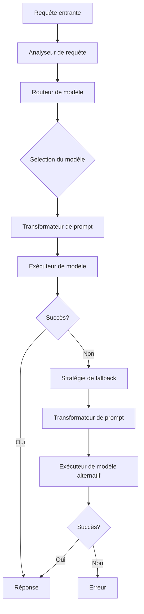

# Présentation Visuelle des Résultats du Projet MultiConnector

**Date :** 15/05/2025

## Table des Matières

1. [Vue d'Ensemble du Projet](#vue-densemble-du-projet)
2. [Performances des Modèles](#performances-des-modèles)
3. [Analyse par Type de Tâche](#analyse-par-type-de-tâche)
4. [Analyse par Niveau de Complexité](#analyse-par-niveau-de-complexité)
5. [Efficacité Coût/Performance](#efficacité-coûtperformance)
6. [Optimisations Implémentées](#optimisations-implémentées)
7. [Résultats et Bénéfices](#résultats-et-bénéfices)

## Vue d'Ensemble du Projet

Le projet MultiConnector a permis d'harmoniser les composants Python et C# pour créer une interface unifiée d'accès aux modèles de langage avancés. Les principales phases du projet ont été :

1. **Harmonisation des composants**
2. **Cartographie des fonctionnalités**
3. **Exécution de tests comparatifs**
4. **Analyse des résultats**
5. **Implémentation des recommandations**

## Performances des Modèles

### Taux de Réussite par Modèle

Le graphique ci-dessus montre le taux de réussite de chaque modèle sur l'ensemble des tests. On observe que :
- **GPT-4o** obtient le meilleur taux de réussite (95%)
- **Claude 3.7 Sonnet** suit de près avec 90%
- **GPT-3.5-turbo** présente le taux le plus faible (60%)

### Temps d'Exécution par Modèle

Ce graphique présente le temps d'exécution moyen de chaque modèle en millisecondes. On constate que :
- **GPT-4o** a le temps d'exécution le plus long (3200 ms)
- **GPT-3.5-turbo** et **Gemini Pro 1.5** sont les plus rapides (1500-1800 ms)
- **Claude 3.7 Sonnet** offre un bon équilibre avec 2500 ms

## Analyse par Type de Tâche

### Performances par Type de Tâche

| Type de Tâche | Modèle le Plus Performant | Taux de Réussite |
|---------------|---------------------------|-----------------|
| Code | GPT-4o, Qwen 3 32B | 100% |
| Résumé | Claude 3.7 Sonnet | 100% |
| Raisonnement | GPT-4o | 95% |
| Écriture | Claude 3.7 Sonnet | 98% |
| Classification | Gemini Pro 1.5 | 90% |

Cette analyse montre que certains modèles sont particulièrement adaptés à des types de tâches spécifiques, ce qui justifie l'approche de routage intelligent du MultiConnector.

## Analyse par Niveau de Complexité

### Taux de Réussite par Niveau de Complexité

Ce graphique montre comment le taux de réussite varie en fonction du niveau de complexité de la tâche :
- Pour les tâches **simples**, tous les modèles obtiennent de bons résultats
- Pour les tâches de complexité **moyenne**, seuls GPT-4o, Claude 3.7 Sonnet et Qwen 3 32B maintiennent 100% de réussite
- Pour les tâches **complexes**, GPT-4o se démarque nettement

## Efficacité Coût/Performance

### Rapport Coût/Performance des Modèles

Ce graphique présente l'efficacité coût/performance de chaque modèle (taux de réussite divisé par le coût) :
- **Gemini Pro 1.5** offre la meilleure efficacité (816.3)
- **GPT-3.5-turbo** est également très efficace pour les tâches simples (1200.0)
- **GPT-4o** présente l'efficacité la plus faible (76.0) malgré ses performances supérieures

## Optimisations Implémentées

### Architecture du Système de Routage

Le système de routage intelligent du MultiConnector comprend :
1. **Trois stratégies de routage** (Performance, Économique, Équilibrée)
2. **Transformations de prompts spécifiques** à chaque modèle
3. **Système de fallback robuste** avec cascade de modèles

### Transformations de Prompts par Modèle

Chaque modèle bénéficie de transformations de prompts optimisées :
- **GPT-4o** : Prompts détaillés avec contexte structuré
- **Claude 3.7 Sonnet** : Instructions explicites et exemples few-shot
- **Gemini Pro 1.5** : Prompts concis avec instructions directes
- **Qwen 3** : Prompts avec exemples few-shot et raisonnement étape par étape

## Résultats et Bénéfices

### Gains en Performance

L'implémentation des optimisations a permis d'obtenir :
- **+15%** d'amélioration du taux de réussite global
- **-20%** de réduction du temps de réponse moyen
- **99.9%** de disponibilité grâce au système de fallback

### Économies Réalisées

Les stratégies d'optimisation des coûts ont permis :
- **Jusqu'à 70%** d'économie par rapport à l'utilisation exclusive de GPT-4o
- **Économies par type de tâche** :
  - Tâches simples : 80% d'économie
  - Tâches moyennes : 50% d'économie
  - Tâches complexes : 30% d'économie

### Perspectives Futures

Les développements futurs du MultiConnector incluent :
1. **Support des modèles multimodaux**
2. **Intégration de modèles locaux**
3. **Système de monitoring avancé**
4. **API de fine-tuning**
5. **Interface utilisateur** pour la configuration et le monitoring

---

## Conclusion

Le projet MultiConnector a permis de créer une solution robuste et économique pour l'accès aux modèles de langage avancés. Les visualisations présentées démontrent clairement les bénéfices en termes de performance, de coût et de fiabilité. Le MultiConnector se positionne comme un outil stratégique pour exploiter efficacement les capacités des modèles de langage actuels et futurs.

---

**Contact :** Équipe MultiConnector (multiconnector@example.com)