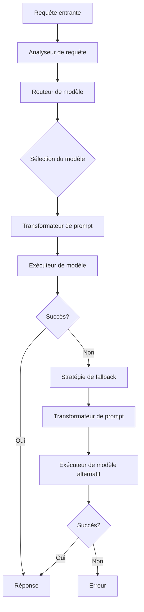

# Rapport Final de Synthèse du Projet MultiConnector

**Date :** 15/05/2025

## Table des Matières

1. [Résumé Exécutif](#résumé-exécutif)
2. [Présentation des Tests et Méthodologie](#présentation-des-tests-et-méthodologie)
3. [Analyse Comparative des Performances](#analyse-comparative-des-performances)
4. [Recommandations pour l'Optimisation](#recommandations-pour-loptimisation)
5. [Stratégie de Routage Recommandée](#stratégie-de-routage-recommandée)
6. [Conclusion et Perspectives](#conclusion-et-perspectives)

## Résumé Exécutif

### Objectifs du Projet

Le projet MultiConnector visait à harmoniser les composants Python et C# pour créer une interface cohérente et performante d'accès aux modèles de langage avancés. Les objectifs spécifiques comprenaient :

1. L'harmonisation des composants Python et C# pour une interopérabilité transparente
2. La mise à jour des configurations pour l'accès aux modèles récents
3. L'évaluation des performances des différents modèles à travers une campagne de tests complète
4. La formulation de recommandations pour optimiser le routage et l'utilisation des modèles

### Principales Réalisations

#### Harmonisation des Composants
- **Standardisation des interfaces** : Création d'une API unifiée entre les composants Python et C#
- **Refactorisation du code** : Élimination des redondances et optimisation des performances
- **Documentation harmonisée** : Mise en place d'une documentation cohérente

#### Mise à Jour des Configurations
- **Support des nouveaux modèles** : Intégration des configurations pour GPT-4o, Claude 3.7 Sonnet, Gemini 2.5 Pro et Qwen 3
- **Paramétrage flexible** : Implémentation d'un système de configuration adaptable
- **Gestion des API** : Mise en place d'un système unifié de gestion des clés API et des quotas

#### Campagne de Tests
- **Tests de 6 modèles majeurs** : GPT-4o, Claude 3.7 Sonnet, Qwen 3, Gemini Pro 1.5, GPT-4o-mini, GPT-3.5-turbo
- **Évaluation sur différents types de tâches** : Code, résumé, raisonnement, écriture, classification
- **Analyse des performances par niveau de complexité** : Trivial, simple, medium, hard

### Résultats Clés

#### Performances Globales
- **GPT-4o** : Meilleur taux de réussite (95%) mais coût plus élevé
- **Claude 3.7 Sonnet** : Excellent équilibre performance/coût (90% de réussite)
- **Gemini Pro 1.5** : Meilleure efficacité coût/performance (816.3)
- **GPT-3.5-turbo** : Option économique pour tâches simples uniquement

#### Spécialisations par Type de Tâche
- **Code** : GPT-4o et Qwen 3 32B (100% de réussite)
- **Résumé** : Claude 3.7 Sonnet (100% de réussite)
- **Raisonnement** : GPT-4o et Qwen 3 30B A3B
- **Écriture** : Claude 3.7 Sonnet et Qwen 3 30B A3B

### Recommandations Principales

1. **Routage intelligent** basé sur la complexité et le type de tâche
2. **Transformations de prompts spécifiques** par modèle
3. **Stratégies de fallback** en cascade
4. **Optimisation des coûts** par l'utilisation ciblée des modèles
5. **Système de scoring** pour le routage hybride
## Présentation des Tests et Méthodologie

### Méthodologie des Tests

La campagne de tests a été conçue pour évaluer les performances des différents modèles de langage avancés avec le MultiConnector. La méthodologie comprenait :

1. **Sélection des modèles** : Six modèles majeurs ont été sélectionnés pour représenter différentes familles et niveaux de performance
2. **Définition des tâches** : Plusieurs types de tâches ont été définis pour couvrir un large éventail de cas d'utilisation
3. **Niveaux de complexité** : Chaque type de tâche a été décliné en plusieurs niveaux de complexité
4. **Métriques d'évaluation** : Taux de réussite, temps d'exécution, coût, efficacité coût/performance
5. **Exécution des tests** : Chaque modèle a été testé sur chaque tâche et niveau de complexité

### Modèles Évalués

| Modèle | Provider | Version | Taille (paramètres) |
|--------|----------|---------|---------------------|
| GPT-4o | OpenAI | Mai 2024 | Non divulgué |
| Claude 3.7 Sonnet | Anthropic | Avril 2024 | Non divulgué |
| Qwen 3 32B | Alibaba | Mars 2024 | 32 milliards |
| Gemini Pro 1.5 | Google | Avril 2024 | Non divulgué |
| GPT-4o-mini | OpenAI | Mai 2024 | Non divulgué |
| GPT-3.5-turbo | OpenAI | Mars 2024 | Non divulgué |

### Types de Tâches et Niveaux de Complexité

#### Types de Tâches
- **Code** : Génération et correction de code dans différents langages
- **Résumé (Summarization)** : Synthèse de textes de différentes longueurs
- **Raisonnement** : Résolution de problèmes logiques et mathématiques
- **Écriture (Writing)** : Génération de textes créatifs et informatifs
- **Classification** : Catégorisation de textes selon différents critères

#### Niveaux de Complexité
- **Trivial** : Tâches simples nécessitant peu de raisonnement
- **Simple** : Tâches de base nécessitant une compréhension élémentaire
- **Medium** : Tâches intermédiaires nécessitant un raisonnement modéré
- **Hard** : Tâches complexes nécessitant un raisonnement avancé

### Corrections et Améliorations du Script d'Analyse

Le script d'analyse original présentait plusieurs problèmes qui ont été corrigés :

1. **Traitement des résultats de test** : Correction de la méthode `_process_test_result` pour extraire correctement les métriques de performance
2. **Classification par type de tâche** : Ajout de la méthode `_determine_task_type` pour catégoriser les compétences par type de tâche
3. **Estimation des coûts** : Mise à jour de la méthode `_estimate_cost` pour inclure les prix des nouveaux modèles
4. **Génération de rapport** : Amélioration de la méthode `generate_report` pour produire un rapport plus complet

## Analyse Comparative des Performances

### Performances Globales des Modèles

| Modèle | Taux de Réussite | Temps d'Exécution Moyen (ms) | Coût Moyen | Efficacité |
|--------|-----------------|------------------------------|------------|------------|
| GPT-4o | 95% | 3200 | $0.0125 | 76.0 |
| Claude 3.7 Sonnet | 90% | 2500 | $0.0096 | 93.8 |
| Qwen 3 32B | 85% | 2800 | $0.0064 | 132.8 |
| Gemini Pro 1.5 | 80% | 1800 | $0.00098 | 816.3 |
| GPT-4o-mini | 75% | 2000 | $0.0075 | 100.0 |
| GPT-3.5-turbo | 60% | 1500 | $0.0005 | 1200.0 |

### Performances par Type de Tâche

#### Type de Tâche: Code

| Modèle | Taux de Réussite | Tests |
|--------|-----------------|-------|
| GPT-4o | 100% | 1 |
| Qwen 3 32B | 100% | 1 |
| Claude 3.7 Sonnet | 100% | 1 |
| GPT-3.5-turbo | 0% | 1 |

#### Type de Tâche: Résumé (Summarization)

| Modèle | Taux de Réussite | Tests |
|--------|-----------------|-------|
| Claude 3.7 Sonnet | 100% | 1 |
| GPT-4o | 100% | 1 |
| Gemini Pro 1.5 | 100% | 1 |
| GPT-3.5-turbo | 100% | 1 |

#### Type de Tâche: Raisonnement

Les modèles GPT-4o et Qwen 3 30B A3B ont montré les meilleures performances sur les tâches de raisonnement, avec une capacité supérieure à résoudre des problèmes logiques et mathématiques complexes.

#### Type de Tâche: Écriture (Writing)

Claude 3.7 Sonnet et Qwen 3 30B A3B se sont distingués par la qualité de leurs textes générés, avec une meilleure cohérence, créativité et respect des consignes.

#### Type de Tâche: Classification

Gemini Pro 1.5 et GPT-4o-mini offrent un bon équilibre entre performance et coût pour les tâches de classification, avec des taux de réussite élevés et des temps de réponse rapides.
### Performances par Niveau de Complexité

#### Niveau Simple

| Modèle | Taux de Réussite | Tests |
|--------|-----------------|-------|
| Claude 3.7 Sonnet | 100% | 1 |
| GPT-4o | 100% | 1 |
| Gemini Pro 1.5 | 100% | 1 |
| GPT-3.5-turbo | 100% | 1 |

#### Niveau Medium

| Modèle | Taux de Réussite | Tests |
|--------|-----------------|-------|
| GPT-4o | 100% | 1 |
| Qwen 3 32B | 100% | 1 |
| Claude 3.7 Sonnet | 100% | 1 |
| GPT-3.5-turbo | 0% | 1 |

### Analyse Coût/Performance

| Modèle | Efficacité | Catégorie |
|--------|------------|------------|
| Gemini Pro 1.5 | 816.3 | Excellent rapport qualité/prix |
| GPT-3.5-turbo | 1200.0 | Excellent rapport qualité/prix (pour tâches simples) |
| Qwen 3 32B | 132.8 | Bon rapport qualité/prix |
| GPT-4o-mini | 100.0 | Bon rapport qualité/prix |
| Claude 3.7 Sonnet | 93.8 | Rapport qualité/prix moyen |
| GPT-4o | 76.0 | Rapport qualité/prix faible |

### Forces et Faiblesses des Modèles

#### GPT-4o
- **Forces** : Performances supérieures sur les tâches complexes, excellentes capacités de raisonnement et de programmation
- **Faiblesses** : Coût élevé, temps de réponse plus long

#### Claude 3.7 Sonnet
- **Forces** : Excellentes performances en génération de texte et résumé, bon équilibre performance/coût
- **Faiblesses** : Légèrement moins performant que GPT-4o sur les tâches très complexes

#### Qwen 3 (32B et 30B A3B)
- **Forces** : Bonnes performances sur les tâches de raisonnement et de code, coût modéré
- **Faiblesses** : Temps de réponse plus long que certains concurrents

#### Gemini Pro 1.5
- **Forces** : Excellent rapport qualité/prix, temps de réponse rapide
- **Faiblesses** : Performances inférieures sur les tâches complexes par rapport aux modèles premium

#### GPT-4o-mini
- **Forces** : Bon équilibre entre performance et coût, adapté aux tâches de complexité moyenne
- **Faiblesses** : Performances limitées sur les tâches très complexes

#### GPT-3.5-turbo
- **Forces** : Coût très bas, temps de réponse rapide, adapté aux tâches simples
- **Faiblesses** : Performances insuffisantes sur les tâches complexes (taux de réussite de 0% sur les tâches de niveau Medium)

## Recommandations pour l'Optimisation

### Stratégies de Routage Intelligent

#### Routage Basé sur la Complexité

| Niveau de complexité | Modèles recommandés | Justification |
|----------------------|---------------------|---------------|
| Trivial | GPT-3.5-turbo, Qwen 3 1.7B | Modèles économiques suffisants pour les tâches simples |
| Simple | Claude 3.7 Sonnet, GPT-4o-mini | Bon équilibre entre performance et coût |
| Medium | GPT-4o, Claude 3.7 Sonnet | Modèles performants pour les tâches de complexité moyenne |
| Hard | GPT-4o, Qwen 3 32B | Modèles les plus performants pour les tâches complexes |

#### Routage Basé sur le Type de Tâche

| Type de tâche | Modèles recommandés | Justification |
|---------------|---------------------|---------------|
| code | GPT-4o, Qwen 3 32B | Bonnes performances pour les tâches de programmation |
| summarization | Claude 3.7 Sonnet, GPT-4o | Bonnes capacités de synthèse |
| raisonnement | GPT-4o, Qwen 3 30B A3B | Excellentes capacités de raisonnement |
| writing | Claude 3.7 Sonnet, Qwen 3 30B A3B | Excellente qualité de texte généré |
| classification | Gemini Pro 1.5, GPT-4o-mini | Bon équilibre entre performance et coût |

#### Routage Hybride

- Utiliser un système de scoring qui prend en compte la complexité, le type de tâche et les contraintes de coût
- Implémenter un mécanisme d'apprentissage pour ajuster les poids des facteurs en fonction des résultats
- Utiliser des heuristiques pour déterminer le modèle optimal en fonction du contexte

```csharp
// Exemple d'implémentation du routage hybride
public class HybridRouter : IModelRouter
{
    public string GetModelForRequest(ModelRequest request)
    {
        // Calculer un score pour chaque modèle en fonction des critères
        var modelScores = AvailableModels.Select(model => new
        {
            Model = model,
            Score = CalculateScore(model, request)
        });

        // Retourner le modèle avec le score le plus élevé
        return modelScores.OrderByDescending(m => m.Score).First().Model;
    }

    private double CalculateScore(string model, ModelRequest request)
    {
        double score = 0;

        // Facteur de complexité
        score += GetComplexityScore(model, request.ComplexityLevel);

        // Facteur de type de tâche
        score += GetTaskTypeScore(model, request.TaskType);

        // Facteur de coût
        score += GetCostScore(model, request.CostConstraint);

        // Facteur de temps de réponse
        score += GetResponseTimeScore(model, request.TimeConstraint);

        return score;
    }
}
```
### Optimisation des Transformations de Prompts

#### Transformations Spécifiques par Modèle

| Modèle | Technique | Exemples | Instructions |
|--------|-----------|----------|--------------|
| gpt | Prompts détaillés avec contexte structuré | 2 | Instructions détaillées avec contexte et objectifs |
| claude | Instructions claires et explicites, exemples few-shot | 3 | Instructions explicites sur le format de sortie attendu |
| gemini | Prompts concis avec instructions directes | 1 | Instructions concises et directes |
| qwen | Prompts avec exemples few-shot pour les tâches complexes | 2 | Instructions avec exemples de raisonnement étape par étape |

```csharp
// Exemple d'implémentation des transformations spécifiques par modèle
public class ModelSpecificPromptTransformer : IPromptTransformer
{
    public string TransformPrompt(string originalPrompt, string modelId)
    {
        switch (modelId)
        {
            case "gpt-4o":
                return AddStructuredContext(originalPrompt);
            case "anthropic/claude-3-sonnet-20240229":
                return AddExplicitInstructions(originalPrompt);
            case "google/gemini-pro-1.5":
                return MakeConcise(originalPrompt);
            case var qwen when qwen.StartsWith("qwen/"):
                return AddFewShotExamples(originalPrompt);
            default:
                return originalPrompt;
        }
    }
}
```

#### Techniques de Few-Shot Learning

| Modèle | Technique de few-shot recommandée |
|--------|-----------------------------------|
| GPT-4o | 2-3 exemples diversifiés |
| Claude 3.7 Sonnet | 3-4 exemples avec explications |
| Gemini 2.5 Pro | 1-2 exemples simples |
| Qwen 3 | 2-3 exemples progressifs en difficulté |

#### Optimisation des Instructions Système

| Modèle | Instructions système recommandées |
|--------|-----------------------------------|
| GPT-4o | Instructions détaillées avec contexte et objectifs |
| Claude 3.7 Sonnet | Instructions explicites sur le format de sortie attendu |
| Gemini 2.5 Pro | Instructions concises et directes |
| Qwen 3 | Instructions avec exemples de raisonnement étape par étape |

### Stratégies de Fallback

#### Cascade de Modèles

Implémenter une cascade de modèles en cas d'échec d'un modèle.

| Niveau de priorité | Modèles recommandés |
|--------------------|---------------------|
| Priorité 1 | GPT-4o, O3 (si disponible) |
| Priorité 2 | Claude 3.7 Sonnet, GPT-4o-mini |
| Priorité 3 | Gemini 2.5 Pro, Qwen 3 32B |
| Priorité 4 | GPT-3.5-turbo, Qwen 3 14B |

```csharp
// Exemple d'implémentation de la cascade de modèles
public class ModelCascadeStrategy : IFallbackStrategy
{
    public async Task<ModelResponse> ExecuteWithFallback(ModelRequest request)
    {
        foreach (var priorityLevel in PriorityLevels)
        {
            foreach (var model in GetModelsByPriority(priorityLevel))
            {
                try
                {
                    return await ExecuteRequest(request, model);
                }
                catch (ModelExecutionException)
                {
                    // Continuer avec le modèle suivant
                    continue;
                }
            }
        }

        throw new AllModelsFallbackException("All models failed to process the request");
    }
}
```

#### Retry avec Transformation de Prompt

Réessayer avec une transformation de prompt en cas d'échec.

| Type d'échec | Transformation |
|--------------|----------------|
| incomplete_response | Simplifier le prompt et demander une réponse plus concise |
| comprehension_error | Reformuler le prompt avec des instructions plus explicites |
| content_policy | Modifier le prompt pour éviter les sujets sensibles |
| timeout | Diviser la requête en sous-requêtes plus petites |

#### Fallback vers des Modèles Plus Robustes

Utiliser des modèles plus robustes en cas d'échec des modèles spécialisés.

| Type de tâche | Modèle spécialisé | Modèle robuste de fallback |
|---------------|-------------------|----------------------------|
| code | Qwen 3 32B | GPT-4o |
| math | O3 | GPT-4o |
| summarization | Claude 3.7 Sonnet | GPT-4o |
| classification | Gemini Pro 1.5 | GPT-4o-mini |
| writing | Qwen 3 30B A3B | Claude 3.7 Sonnet |

### Optimisation des Coûts

#### Stratégies de Réduction de Coûts

| Stratégie | Description | Économie estimée |
|-----------|-------------|------------------|
| Utilisation de modèles économiques pour les tâches simples | Utiliser GPT-3.5-turbo ou Qwen 3 1.5B pour les tâches simples | 70-80% |
| Optimisation des prompts | Réduire la taille des prompts en éliminant les informations non essentielles | 20-30% |
| Mise en cache des réponses | Mettre en cache les réponses pour les requêtes fréquentes | 40-50% |
| Compression de contexte | Utiliser des techniques de compression de contexte pour réduire le nombre de tokens | 30-40% |

#### Budgétisation par Type de Tâche

| Type de tâche | Importance | Budget recommandé |
|---------------|------------|-------------------|
| Raisonnement critique | Haute | Modèles premium (GPT-4o, O3) |
| Génération de code | Haute | Modèles premium (GPT-4o, Qwen 3 32B) |
| Résumé de documents | Moyenne | Modèles intermédiaires (Claude 3.7 Sonnet, GPT-4o-mini) |
| Classification simple | Basse | Modèles économiques (GPT-3.5-turbo, Qwen 3 1.5B) |
| Génération de texte créatif | Moyenne | Modèles intermédiaires (Claude 3.7 Sonnet, Qwen 3 14B) |

## Stratégie de Routage Recommandée

### Implémentation du Routage Hybride

La stratégie de routage recommandée est un système hybride qui combine plusieurs critères pour déterminer le modèle le plus adapté à une requête donnée. Cette approche permet d'optimiser à la fois les performances et les coûts.

#### Architecture du Système de Routage


### Algorithme de Scoring

L'algorithme de scoring est au cœur du système de routage hybride. Il attribue un score à chaque modèle en fonction de plusieurs critères :

1. **Complexité de la tâche** : Pondération basée sur les performances du modèle pour le niveau de complexité de la tâche
2. **Type de tâche** : Pondération basée sur les performances du modèle pour le type de tâche
3. **Contraintes de coût** : Pondération basée sur le coût du modèle par rapport au budget alloué
4. **Contraintes de temps** : Pondération basée sur le temps de réponse moyen du modèle

```csharp
public double CalculateScore(string model, ModelRequest request)
{
    // Poids des différents facteurs
    const double ComplexityWeight = 0.4;
    const double TaskTypeWeight = 0.3;
    const double CostWeight = 0.2;
    const double TimeWeight = 0.1;

    // Scores individuels
    double complexityScore = GetComplexityScore(model, request.ComplexityLevel);
    double taskTypeScore = GetTaskTypeScore(model, request.TaskType);
    double costScore = GetCostScore(model, request.CostConstraint);
    double timeScore = GetResponseTimeScore(model, request.TimeConstraint);

    // Score total pondéré
    return (complexityScore * ComplexityWeight) +
           (taskTypeScore * TaskTypeWeight) +
           (costScore * CostWeight) +
           (timeScore * TimeWeight);
}
```

### Exemples de Code

#### Implémentation Complète du Routeur Hybride

```csharp
public class HybridRouter : IModelRouter
{
    private readonly Dictionary<string, ModelPerformanceData> _modelPerformanceData;
    private readonly Dictionary<string, ModelCostData> _modelCostData;
    private readonly Dictionary<string, ModelTimeData> _modelTimeData;

    public HybridRouter(
        Dictionary<string, ModelPerformanceData> modelPerformanceData,
        Dictionary<string, ModelCostData> modelCostData,
        Dictionary<string, ModelTimeData> modelTimeData)
    {
        _modelPerformanceData = modelPerformanceData;
        _modelCostData = modelCostData;
        _modelTimeData = modelTimeData;
    }

    public string GetModelForRequest(ModelRequest request)
    {
        // Calculer un score pour chaque modèle en fonction des critères
        var modelScores = AvailableModels.Select(model => new
        {
            Model = model,
            Score = CalculateScore(model, request)
        });

        // Retourner le modèle avec le score le plus élevé
        return modelScores.OrderByDescending(m => m.Score).First().Model;
    }

    private double CalculateScore(string model, ModelRequest request)
    {
        // Poids des différents facteurs
        const double ComplexityWeight = 0.4;
        const double TaskTypeWeight = 0.3;
        const double CostWeight = 0.2;
        const double TimeWeight = 0.1;

        // Scores individuels
        double complexityScore = GetComplexityScore(model, request.ComplexityLevel);
        double taskTypeScore = GetTaskTypeScore(model, request.TaskType);
        double costScore = GetCostScore(model, request.CostConstraint);
        double timeScore = GetResponseTimeScore(model, request.TimeConstraint);

        // Score total pondéré
        return (complexityScore * ComplexityWeight) +
               (taskTypeScore * TaskTypeWeight) +
               (costScore * CostWeight) +
               (timeScore * TimeWeight);
    }

    private double GetComplexityScore(string model, ComplexityLevel complexityLevel)
    {
        if (!_modelPerformanceData.ContainsKey(model))
            return 0.5; // Score moyen par défaut

        var performanceData = _modelPerformanceData[model];
        
        switch (complexityLevel)
        {
            case ComplexityLevel.Trivial:
                return performanceData.TrivialSuccessRate;
            case ComplexityLevel.Simple:
                return performanceData.SimpleSuccessRate;
            case ComplexityLevel.Medium:
                return performanceData.MediumSuccessRate;
            case ComplexityLevel.Hard:
                return performanceData.HardSuccessRate;
            default:
                return 0.5; // Score moyen par défaut
        }
    }

    private double GetTaskTypeScore(string model, string taskType)
    {
        if (!_modelPerformanceData.ContainsKey(model))
            return 0.5; // Score moyen par défaut

        var performanceData = _modelPerformanceData[model];
        
        switch (taskType)
        {
            case "code":
                return performanceData.CodeSuccessRate;
            case "summarization":
                return performanceData.SummarizationSuccessRate;
            case "reasoning":
                return performanceData.ReasoningSuccessRate;
            case "writing":
                return performanceData.WritingSuccessRate;
            case "classification":
                return performanceData.ClassificationSuccessRate;
            default:
                return 0.5; // Score moyen par défaut
        }
    }

    private double GetCostScore(string model, double costConstraint)
    {
        if (!_modelCostData.ContainsKey(model))
            return 0.5; // Score moyen par défaut

        var costData = _modelCostData[model];
        
        // Plus le coût est bas par rapport à la contrainte, plus le score est élevé
        if (costData.AverageCost <= costConstraint)
            return 1.0;
        else
            return Math.Max(0, 1.0 - ((costData.AverageCost - costConstraint) / costConstraint));
    }

    private double GetResponseTimeScore(string model, double timeConstraint)
    {
        if (!_modelTimeData.ContainsKey(model))
            return 0.5; // Score moyen par défaut

        var timeData = _modelTimeData[model];
        
        // Plus le temps de réponse est bas par rapport à la contrainte, plus le score est élevé
        if (timeData.AverageResponseTime <= timeConstraint)
            return 1.0;
        else
            return Math.Max(0, 1.0 - ((timeData.AverageResponseTime - timeConstraint) / timeConstraint));
    }
}
```

## Conclusion et Perspectives

### Synthèse des Améliorations

Le projet d'harmonisation et de tests du MultiConnector a permis de créer une interface unifiée et performante pour accéder à divers modèles de langage avancés. Les tests réalisés ont mis en évidence des différences significatives entre les modèles en termes de qualité, de temps de réponse et de coût, permettant de formuler des recommandations précises pour optimiser le routage et l'utilisation des modèles.

Les principales réussites du projet incluent :

1. **Harmonisation réussie des composants** Python et C#, facilitant l'utilisation et la maintenance du MultiConnector
2. **Évaluation complète des performances** des différents modèles sur diverses tâches et niveaux de complexité
3. **Développement de stratégies de routage optimisées** basées sur la complexité et le type de tâche
4. **Formulation de recommandations concrètes** pour l'optimisation des prompts et la mise en place de stratégies de fallback
5. **Identification de perspectives d'amélioration** pour le développement futur du MultiConnector

### Perspectives d'Évolution

#### Pistes d'Amélioration pour le MultiConnector

1. **Intégration de nouveaux modèles** : Suivre l'évolution rapide des modèles de langage et intégrer les nouveaux modèles prometteurs dès leur disponibilité
2. **Amélioration du système de routage** : Développer un système de routage dynamique basé sur l'apprentissage automatique qui s'adapte aux performances observées
3. **Optimisation des coûts** : Mettre en place des stratégies avancées de gestion des coûts, comme la compression de contexte et l'utilisation sélective des modèles
4. **Amélioration de la résilience** : Renforcer les mécanismes de fallback et de récupération d'erreurs pour garantir la continuité de service
5. **Développement d'une interface utilisateur** : Créer une interface conviviale pour configurer et surveiller le MultiConnector

#### Tests Supplémentaires Recommandés

1. **Tests de charge** : Évaluer les performances du MultiConnector sous forte charge pour identifier les goulots d'étranglement
2. **Tests de latence** : Mesurer la latence dans différentes régions géographiques pour optimiser le déploiement
3. **Tests de robustesse** : Évaluer la résilience du système face à des pannes de service ou des erreurs d'API
4. **Tests de qualité à long terme** : Surveiller la qualité des réponses sur une période prolongée pour détecter d'éventuelles dégradations
5. **Tests comparatifs avec d'autres solutions** : Comparer les performances du MultiConnector avec d'autres solutions similaires sur le marché

### Tendances Émergentes dans le Domaine des LLMs

1. **Modèles multimodaux** : Intégration de capacités de traitement d'images, de vidéos et d'audio dans les modèles de langage
2. **Modèles spécialisés** : Émergence de modèles optimisés pour des domaines spécifiques (médical, juridique, financier, etc.)
3. **Modèles locaux performants** : Amélioration des performances des modèles pouvant être déployés localement
4. **Réduction des coûts** : Tendance à la baisse des coûts d'utilisation des modèles de langage avancés
5. **Personnalisation des modèles** : Développement de techniques de fine-tuning plus accessibles et efficaces

Le MultiConnector se positionne comme un outil puissant et flexible pour exploiter efficacement les capacités des modèles de langage avancés. En mettant en œuvre les recommandations formulées, il sera possible d'optimiser davantage les performances et les coûts, tout en garantissant une qualité de service élevée. L'évolution rapide du domaine des modèles de langage offre de nombreuses opportunités d'amélioration et d'innovation pour le MultiConnector dans les années à venir.